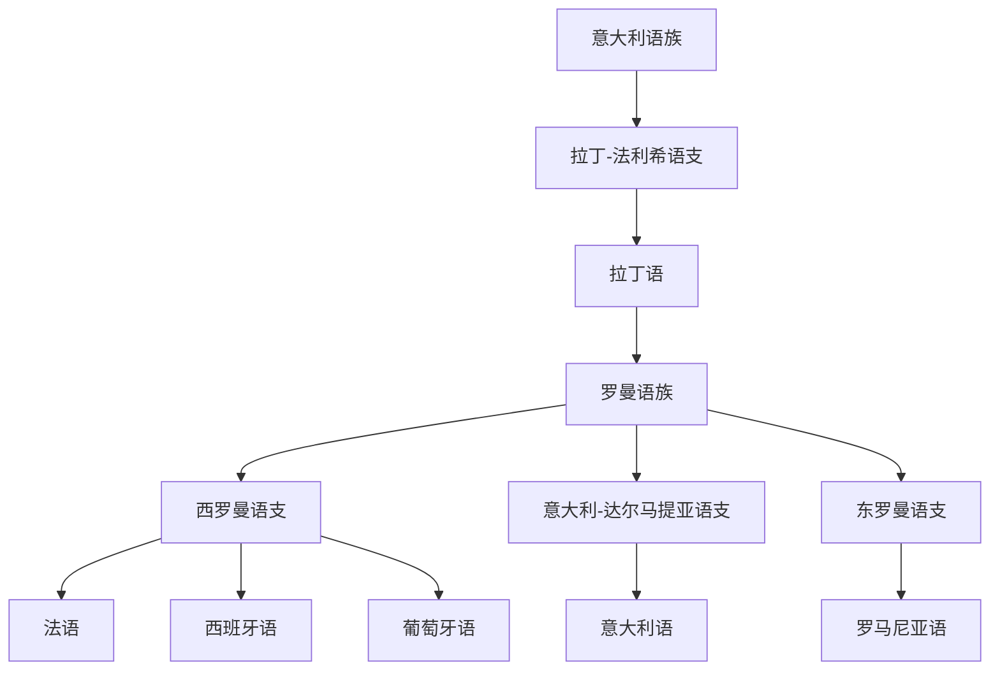

# 意大利语族

## 概括

意大利语族属于印欧语系，最重要的历史语言是拉丁语；现代罗曼语族由通俗拉丁语演变而来。

## 分类关系

## 子系统

| 分支 / 语言 | 代表内容 | 说明 |
|---|---|---|
| 拉丁-法利希语支 | 拉丁语 | 罗马国家和拉丁文学的语言。 |
| 罗曼语族 | 法语、西班牙语、葡萄牙语、意大利语、罗马尼亚语 | 由拉丁语在不同地区演变形成。 |

## 说明

罗曼语族的内部分类有不同方案；奥依语、伊比利亚-罗曼语支、东罗曼语支可作为罗曼语族内部层级理解。

## 上级

- [印欧语系](/%E4%BA%BA%E6%96%87%E7%A7%91%E5%AD%A6/%E8%AF%AD%E8%A8%80/%E5%8D%B0%E6%AC%A7%E8%AF%AD%E7%B3%BB/README.md)

