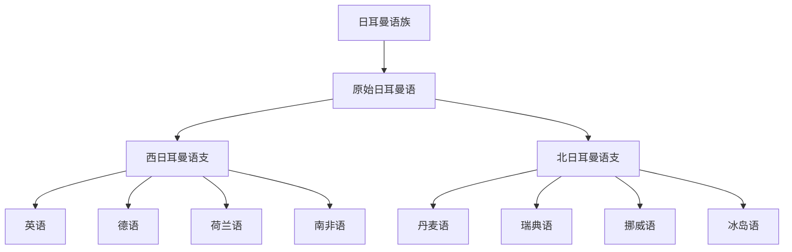

# 日耳曼语族

## 概括

日耳曼语族由原始日耳曼语发展而来，通常分为西日耳曼、北日耳曼和已灭绝的东日耳曼分支。

## 分类关系

## 子系统

| 分支 / 语言 | 代表内容 | 说明 |
|---|---|---|
| 西日耳曼语支 | 英语、德语、荷兰语、南非语 | 英语属盎格鲁-弗里西传统；德语内部有高地德语等层级。 |
| 北日耳曼语支 | 丹麦语、瑞典语、挪威语、冰岛语 | 斯堪的纳维亚语言主干。 |

## 说明

古卢恩文是早期日耳曼书写系统之一，不是“原始日耳曼语”的唯一书写方式。

## 上级

- [印欧语系](/%E4%BA%BA%E6%96%87%E7%A7%91%E5%AD%A6/%E8%AF%AD%E8%A8%80/%E5%8D%B0%E6%AC%A7%E8%AF%AD%E7%B3%BB/README.md)

