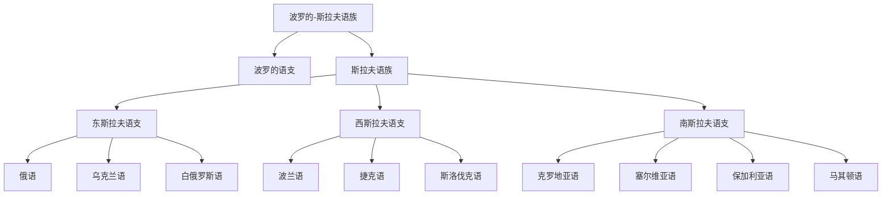

# 波罗的-斯拉夫语族

## 概括

波罗的-斯拉夫语族包括波罗的语支和斯拉夫语族。本目录重点展开斯拉夫语族。

## 分类关系

## 子系统

| 分支 / 语言 | 代表内容 | 说明 |
|---|---|---|
| 东斯拉夫语支 | 俄语、乌克兰语、白俄罗斯语 | 多用西里尔字母。 |
| 西斯拉夫语支 | 波兰语、捷克语、斯洛伐克语 | 多用拉丁字母。 |
| 南斯拉夫语支 | 塞尔维亚语、克罗地亚语、保加利亚语、马其顿语、斯洛文尼亚语 | 文字使用拉丁字母和西里尔字母并存。 |

## 说明

克罗地亚语主要用拉丁字母；塞尔维亚语可用西里尔字母和拉丁字母。

## 上级

- [印欧语系](/%E4%BA%BA%E6%96%87%E7%A7%91%E5%AD%A6/%E8%AF%AD%E8%A8%80/%E5%8D%B0%E6%AC%A7%E8%AF%AD%E7%B3%BB/README.md)

