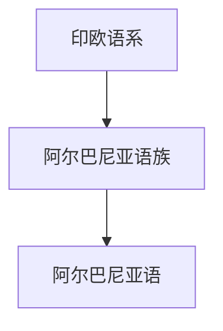

# 阿尔巴尼亚语族

## 概括

阿尔巴尼亚语族是印欧语系的独立分支，现代代表语言主要是阿尔巴尼亚语。

## 分类关系

## 子系统

| 分支 / 语言 | 代表内容 | 说明 |
|---|---|---|
| 阿尔巴尼亚语 | 拉丁字母 | 现代代表语言。 |

## 说明

拉丁字母是书写系统，不是语族分类本身。

## 上级

- [印欧语系](/%E4%BA%BA%E6%96%87%E7%A7%91%E5%AD%A6/%E8%AF%AD%E8%A8%80/%E5%8D%B0%E6%AC%A7%E8%AF%AD%E7%B3%BB/README.md)

