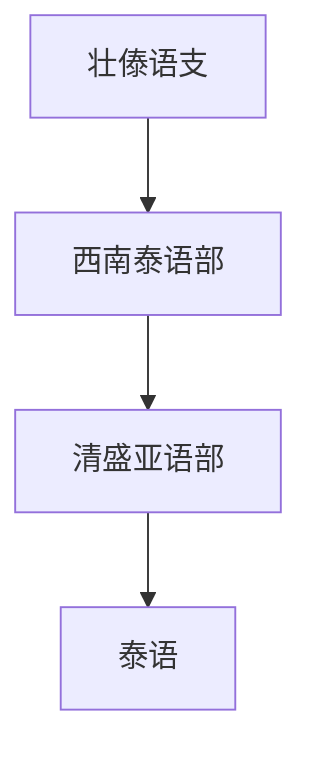

# 壮傣语支

## 概括

壮傣语支在 本目录主要列出西南泰语部、清盛亚语部和泰语。

## 分类关系

## 子系统

| 分支 / 语言 | 代表内容 | 说明 |
|---|---|---|
| 西南泰语部 | 泰语 | 泰语现代标准书写使用泰文。 |

## 说明

该层级用于保留主要分支、代表语言、书写系统和分类争议。

## 上级

- [侗台语族](/%E4%BA%BA%E6%96%87%E7%A7%91%E5%AD%A6/%E8%AF%AD%E8%A8%80/%E5%A3%AE%E4%BE%97%E8%AF%AD%E7%B3%BB/%E4%BE%97%E5%8F%B0%E8%AF%AD%E6%97%8F/README.md)

