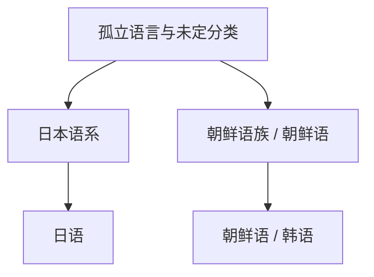

# 孤立语言与未定分类

## 概括

孤立语言指目前未能证明与其他语言存在亲缘关系的语言。实际整理时还应区分“小语系”“未定分类”和“争议分类”。日语和朝鲜语/韩语不宜简单都写成“孤立语言”：日语通常归入日本语系；朝鲜语/韩语常被视作朝鲜语族或孤立语式的小语系。

## 分类关系

## 子系统

| 名称 | 代表语言 | 说明 |
|---|---|---|
| [日语](/%E4%BA%BA%E6%96%87%E7%A7%91%E5%AD%A6/%E8%AF%AD%E8%A8%80/%E5%AD%A4%E7%AB%8B%E8%AF%AD%E8%A8%80%E4%B8%8E%E6%9C%AA%E5%AE%9A%E5%88%86%E7%B1%BB/%E6%97%A5%E8%AF%AD/README.md) | 日语 | 常归入日本语系，不简单等同孤立语言。 |
| [朝鲜语 / 韩语](/%E4%BA%BA%E6%96%87%E7%A7%91%E5%AD%A6/%E8%AF%AD%E8%A8%80/%E5%AD%A4%E7%AB%8B%E8%AF%AD%E8%A8%80%E4%B8%8E%E6%9C%AA%E5%AE%9A%E5%88%86%E7%B1%BB/%E6%9C%9D%E9%B2%9C%E8%AF%AD%E9%9F%A9%E8%AF%AD/README.md) | 朝鲜语 / 韩语 | 常作为朝鲜语族或孤立语处理。 |

## 说明

- 日语使用汉字和假名；文字系统不等于语言谱系。
- 朝鲜语/韩语主要使用谚文，在韩国也称韩语，在朝鲜称朝鲜语。

