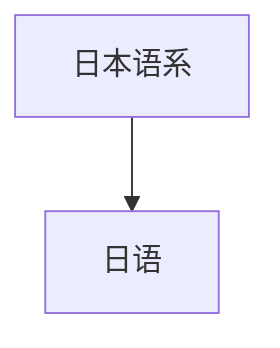

# 日语

## 概括

日语是日本语系的主要语言，标准书写系统混用汉字、平假名、片假名。

## 分类关系

## 子系统

| 分支 / 语言 | 代表内容 | 说明 |
|---|---|---|
| 日语 | 汉字、平假名、片假名 | 不应因使用汉字而归入汉语族。 |

## 说明

日语与朝鲜语、阿尔泰诸语的关系有过假说，但未成为普遍接受的确定亲缘分类。

## 上级

- [孤立语言与未定分类](/%E4%BA%BA%E6%96%87%E7%A7%91%E5%AD%A6/%E8%AF%AD%E8%A8%80/%E5%AD%A4%E7%AB%8B%E8%AF%AD%E8%A8%80%E4%B8%8E%E6%9C%AA%E5%AE%9A%E5%88%86%E7%B1%BB/README.md)

