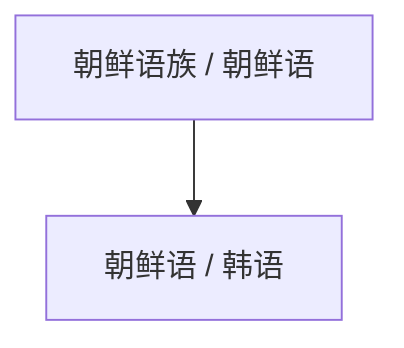

# 朝鲜语 / 韩语

## 概括

朝鲜语/韩语是朝鲜半岛主要语言，现代标准书写使用谚文。

## 分类关系

## 子系统

| 分支 / 语言 | 代表内容 | 说明 |
|---|---|---|
| 朝鲜语 / 韩语 | 谚文 | 名称随地区和政治语境不同而不同。 |

## 说明

朝鲜语/韩语常作为独立小语系或孤立语处理；不应因地理接近而直接归入汉藏语系或阿尔泰语系。

## 上级

- [孤立语言与未定分类](/%E4%BA%BA%E6%96%87%E7%A7%91%E5%AD%A6/%E8%AF%AD%E8%A8%80/%E5%AD%A4%E7%AB%8B%E8%AF%AD%E8%A8%80%E4%B8%8E%E6%9C%AA%E5%AE%9A%E5%88%86%E7%B1%BB/README.md)

