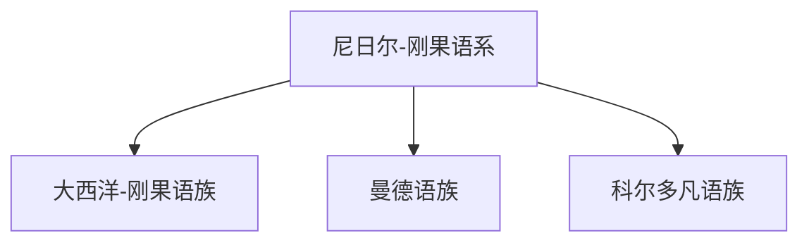

# 尼日尔-刚果语系

## 概括

尼日尔-刚果语系是撒哈拉以南非洲的重要语系，按语言数量计是世界大型语系之一。

## 分类关系

## 子系统

| 分支 / 语言 | 代表内容 | 说明 |
|---|---|---|
| [大西洋-刚果语族](/%E4%BA%BA%E6%96%87%E7%A7%91%E5%AD%A6/%E8%AF%AD%E8%A8%80/%E5%B0%BC%E6%97%A5%E5%B0%94-%E5%88%9A%E6%9E%9C%E8%AF%AD%E7%B3%BB/%E5%A4%A7%E8%A5%BF%E6%B4%8B-%E5%88%9A%E6%9E%9C%E8%AF%AD%E6%97%8F/README.md) | 班图诸语言等 | 语种多、分布广。 |
| [曼德语族](/%E4%BA%BA%E6%96%87%E7%A7%91%E5%AD%A6/%E8%AF%AD%E8%A8%80/%E5%B0%BC%E6%97%A5%E5%B0%94-%E5%88%9A%E6%9E%9C%E8%AF%AD%E7%B3%BB/%E6%9B%BC%E5%BE%B7%E8%AF%AD%E6%97%8F/README.md) | 曼德诸语言 | 西非重要分支。 |
| [科尔多凡语族](/%E4%BA%BA%E6%96%87%E7%A7%91%E5%AD%A6/%E8%AF%AD%E8%A8%80/%E5%B0%BC%E6%97%A5%E5%B0%94-%E5%88%9A%E6%9E%9C%E8%AF%AD%E7%B3%BB/%E7%A7%91%E5%B0%94%E5%A4%9A%E5%87%A1%E8%AF%AD%E6%97%8F/README.md) | 科尔多凡诸语言 | 与尼日尔-刚果整体关系在不同分类中有讨论。 |

## 说明

尼日尔-刚果内部分类复杂，部分传统分支的层级和归属存在学术讨论。

## 上级

- [语言](/%E4%BA%BA%E6%96%87%E7%A7%91%E5%AD%A6/%E8%AF%AD%E8%A8%80/README.md)

