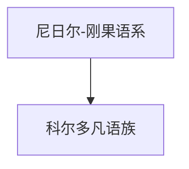

# 科尔多凡语族

## 概括

科尔多凡语族主要与苏丹科尔多凡地区相关，在尼日尔-刚果内部的层级和归属有讨论。

## 分类关系

## 子系统

| 分支 / 语言 | 代表内容 | 说明 |
|---|---|---|
| 科尔多凡语族 | 代表语言待补充 | 本节点先保留体系位置，代表语言可继续补充。 |

## 说明

该层级用于保留主要分支、代表语言、书写系统和分类争议。

## 上级

- [尼日尔-刚果语系](/%E4%BA%BA%E6%96%87%E7%A7%91%E5%AD%A6/%E8%AF%AD%E8%A8%80/%E5%B0%BC%E6%97%A5%E5%B0%94-%E5%88%9A%E6%9E%9C%E8%AF%AD%E7%B3%BB/README.md)

