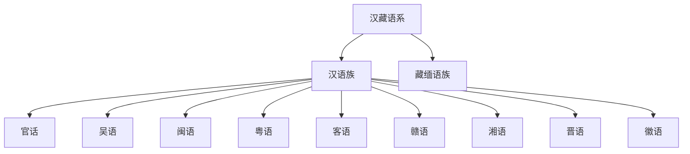

# 汉藏语系

## 范围

汉藏语系主要分布于中国、缅甸、喜马拉雅地区和东南亚大陆北部。

## 概括

汉藏语系通常包括汉语族和藏缅语族两大层级。汉语族内部可继续整理官话、吴语、粤语、闽语、客语、赣语、湘语、晋语、徽语等汉语分支；藏缅语族则包括藏语、缅甸语等大量语言。

## 分类关系

## 子系统

| 分支 | 代表语言 / 方言群 | 说明 |
|---|---|---|
| [汉语族](/%E4%BA%BA%E6%96%87%E7%A7%91%E5%AD%A6/%E8%AF%AD%E8%A8%80/%E6%B1%89%E8%97%8F%E8%AF%AD%E7%B3%BB/%E6%B1%89%E8%AF%AD%E6%97%8F/README.md) | 官话、吴语、粤语、闽语等 | 主要使用汉字书写，也有拼音、拉丁化和地方书写传统。 |
| [藏缅语族](/%E4%BA%BA%E6%96%87%E7%A7%91%E5%AD%A6/%E8%AF%AD%E8%A8%80/%E6%B1%89%E8%97%8F%E8%AF%AD%E7%B3%BB/%E8%97%8F%E7%BC%85%E8%AF%AD%E6%97%8F/README.md) | 藏语、缅甸语、宗喀语 | 分支复杂，内部分类仍有不同方案。 |

