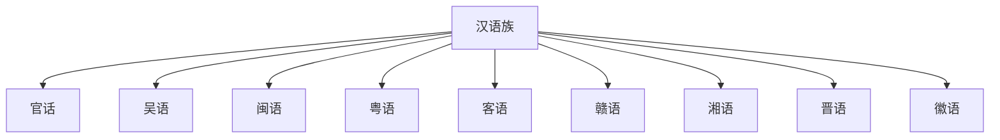

# 汉语族

## 概括

汉语族是汉藏语系的重要分支，包括官话、吴语、粤语、闽语、客语、赣语、湘语、晋语、徽语等。这里按语言 / 方言群整理，不把“汉字”作为分类名称的一部分。

## 分类关系

## 子系统

| 分支 | 主要分布 | 代表点 |
|---|---|---|
| [官话](/%E4%BA%BA%E6%96%87%E7%A7%91%E5%AD%A6/%E8%AF%AD%E8%A8%80/%E6%B1%89%E8%97%8F%E8%AF%AD%E7%B3%BB/%E6%B1%89%E8%AF%AD%E6%97%8F/%E5%AE%98%E8%AF%9D/README.md) | 中国北方、西南、江淮等 | 北京话、成都话、南京话、兰州话 |
| [吴语](/%E4%BA%BA%E6%96%87%E7%A7%91%E5%AD%A6/%E8%AF%AD%E8%A8%80/%E6%B1%89%E8%97%8F%E8%AF%AD%E7%B3%BB/%E6%B1%89%E8%AF%AD%E6%97%8F/%E5%90%B4%E8%AF%AD/README.md) | 江苏南部、上海、浙江等 | 上海话、苏州话、温州话 |
| [闽语](/%E4%BA%BA%E6%96%87%E7%A7%91%E5%AD%A6/%E8%AF%AD%E8%A8%80/%E6%B1%89%E8%97%8F%E8%AF%AD%E7%B3%BB/%E6%B1%89%E8%AF%AD%E6%97%8F/%E9%97%BD%E8%AF%AD/README.md) | 福建、台湾、海南、粤东等 | 厦门话、福州话、潮州话、海口话 |
| [粤语](/%E4%BA%BA%E6%96%87%E7%A7%91%E5%AD%A6/%E8%AF%AD%E8%A8%80/%E6%B1%89%E8%97%8F%E8%AF%AD%E7%B3%BB/%E6%B1%89%E8%AF%AD%E6%97%8F/%E7%B2%A4%E8%AF%AD/README.md) | 广东、广西、香港、澳门等 | 广州话、香港话、台山话 |
| [客语](/%E4%BA%BA%E6%96%87%E7%A7%91%E5%AD%A6/%E8%AF%AD%E8%A8%80/%E6%B1%89%E8%97%8F%E8%AF%AD%E7%B3%BB/%E6%B1%89%E8%AF%AD%E6%97%8F/%E5%AE%A2%E8%AF%AD/README.md) | 广东、福建、江西、台湾等 | 梅县话、惠阳话、四县腔 |
| [赣语](/%E4%BA%BA%E6%96%87%E7%A7%91%E5%AD%A6/%E8%AF%AD%E8%A8%80/%E6%B1%89%E8%97%8F%E8%AF%AD%E7%B3%BB/%E6%B1%89%E8%AF%AD%E6%97%8F/%E8%B5%A3%E8%AF%AD/README.md) | 江西及周边 | 南昌话、宜春话、吉安话 |
| [湘语](/%E4%BA%BA%E6%96%87%E7%A7%91%E5%AD%A6/%E8%AF%AD%E8%A8%80/%E6%B1%89%E8%97%8F%E8%AF%AD%E7%B3%BB/%E6%B1%89%E8%AF%AD%E6%97%8F/%E6%B9%98%E8%AF%AD/README.md) | 湖南及周边 | 长沙话、湘乡话、衡阳话 |
| [晋语](/%E4%BA%BA%E6%96%87%E7%A7%91%E5%AD%A6/%E8%AF%AD%E8%A8%80/%E6%B1%89%E8%97%8F%E8%AF%AD%E7%B3%BB/%E6%B1%89%E8%AF%AD%E6%97%8F/%E6%99%8B%E8%AF%AD/README.md) | 山西及周边 | 太原话、大同话、延安话 |
| [徽语](/%E4%BA%BA%E6%96%87%E7%A7%91%E5%AD%A6/%E8%AF%AD%E8%A8%80/%E6%B1%89%E8%97%8F%E8%AF%AD%E7%B3%BB/%E6%B1%89%E8%AF%AD%E6%97%8F/%E5%BE%BD%E8%AF%AD/README.md) | 安徽南部、浙江、江西局部 | 绩溪话、歙县话、婺源话 |

## 说明

- “汉语方言”在传统中文语境中常用，但从比较语言学和互通度角度看，许多分支差异很大。
- 汉字是主要书写系统；汉语拼音、注音、地方罗马字等属于书写和注音工具。

## 上级

- [汉藏语系](/%E4%BA%BA%E6%96%87%E7%A7%91%E5%AD%A6/%E8%AF%AD%E8%A8%80/%E6%B1%89%E8%97%8F%E8%AF%AD%E7%B3%BB/README.md)

