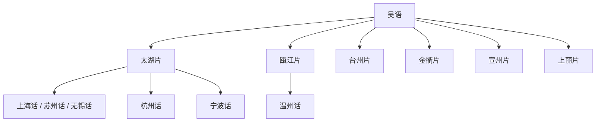

# 吴语

## 概括

主要分布于江苏南部、上海、浙江及安徽、江西、福建局部。

## 分类关系

## 子系统

| 分支 / 语言 | 代表内容 |
|---|---|
| 太湖片 | 上海话、苏州话、无锡话、嘉兴话、杭州话、宁波话、常州话、绍兴话、湖州话等。 |
| 瓯江片 | 温州话、瑞安话、乐清话等。 |
| 台州片 | 天台话、临海话等。 |
| 金衢片 | 金华话等。 |
| 宣州片 | 宣州话、太平话、石台话等。 |
| 上丽片 | 上饶话、丽水话等。 |

## 说明

分片名称和代表点按现有材料整理；不同方言地图和学术方案可能存在边界差异。

## 上级

- [汉语族](/%E4%BA%BA%E6%96%87%E7%A7%91%E5%AD%A6/%E8%AF%AD%E8%A8%80/%E6%B1%89%E8%97%8F%E8%AF%AD%E7%B3%BB/%E6%B1%89%E8%AF%AD%E6%97%8F/README.md)

