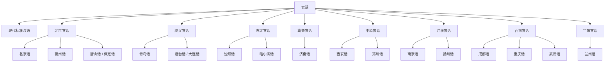

# 官话

## 概括

主要分布于中国北方、西南、江淮等广阔区域，是现代标准汉语的基础方言群。

## 分类关系

## 子系统

| 分支 / 语言 | 代表内容 |
|---|---|
| 北京官话 | 北京话、锦州话、唐山话、保定话等。 |
| 胶辽官话 | 青岛话、烟台话、大连话、丹东话等。 |
| 东北官话 | 沈阳话、长春话、哈尔滨话等。 |
| 冀鲁官话 | 石家庄话、济南话、邢台话、沧州话等。 |
| 中原官话 | 西安话、洛阳话、徐州话、郑州话、开封话、天水话等。 |
| 江淮官话 | 扬州话、南京话、合肥话、南通话、黄冈话等。 |
| 西南官话 | 成都话、重庆话、贵阳话、武汉话、昆明话、桂林话等。 |
| 兰银官话 | 兰州话、银川话、乌鲁木齐话、东干语等。 |

## 说明

分片名称和代表点按现有材料整理；不同方言地图和学术方案可能存在边界差异。

## 上级

- [汉语族](/%E4%BA%BA%E6%96%87%E7%A7%91%E5%AD%A6/%E8%AF%AD%E8%A8%80/%E6%B1%89%E8%97%8F%E8%AF%AD%E7%B3%BB/%E6%B1%89%E8%AF%AD%E6%97%8F/README.md)

