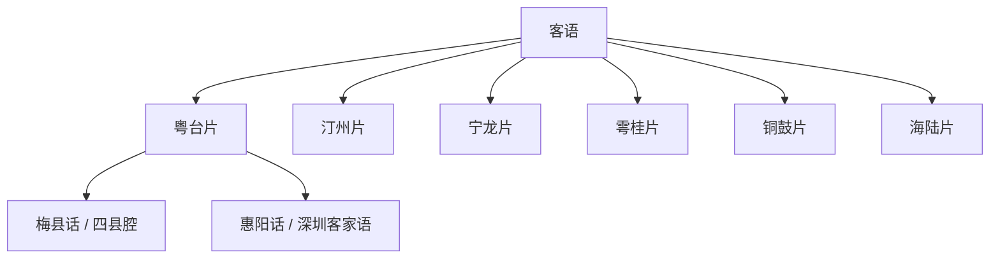

# 客语

## 概括

主要分布于广东、福建、江西、台湾及其他客家移民地区。

## 分类关系

## 子系统

| 分支 / 语言 | 代表内容 |
|---|---|
| 粤台片 | 新丰话、惠阳话、深圳客家语、香港客家语、梅县话、蕉岭话、四县腔等。 |
| 粤中片 | 河源话、龙川话等。 |
| 汀州片 | 长汀话、永定话、宁化话、诏安客语等。 |
| 宁龙片 | 宁都话、龙南话等。 |
| 雩桂片 | 于都话、桂东话等。 |
| 铜鼓片 | 铜鼓话、修水客家语、浏阳客家语等。 |
| 其他 | 粤北片、粤西片、惠州片、海陆片、四川客语、畲话、浙江客语等。 |

## 说明

分片名称和代表点按现有材料整理；不同方言地图和学术方案可能存在边界差异。

## 上级

- [汉语族](/%E4%BA%BA%E6%96%87%E7%A7%91%E5%AD%A6/%E8%AF%AD%E8%A8%80/%E6%B1%89%E8%97%8F%E8%AF%AD%E7%B3%BB/%E6%B1%89%E8%AF%AD%E6%97%8F/README.md)

