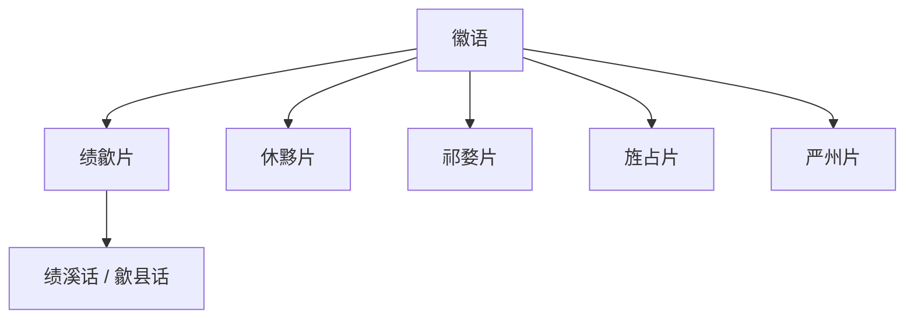

# 徽语

## 概括

主要分布于安徽南部、浙江西部和江西东北部。

## 分类关系

## 子系统

| 分支 / 语言 | 代表内容                  | 说明                     |
| ------- | --------------------- | ---------------------- |
| 绩歙片 | 绩溪话、歙县话等。 |
| 休黟片 | 休宁话、黟县话等。 |
| 祁婺片 | 祁门话、德兴话、浮梁话、婺源话、木塔话等。 |
| 旌占片 | 旌德话、占大话等。 |
| 严州片 | 建德话、寿昌话、淳安话、遂安话、马金话等。 |

## 说明

分片名称和代表点按现有材料整理；不同方言地图和学术方案可能存在边界差异。

## 上级

- [汉语族](/%E4%BA%BA%E6%96%87%E7%A7%91%E5%AD%A6/%E8%AF%AD%E8%A8%80/%E6%B1%89%E8%97%8F%E8%AF%AD%E7%B3%BB/%E6%B1%89%E8%AF%AD%E6%97%8F/README.md)

