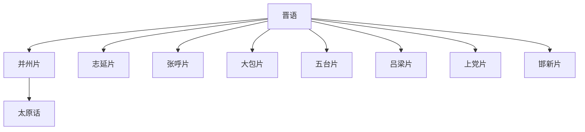

# 晋语

## 概括

主要分布于山西、内蒙古中西部、陕西北部、河北西部、河南北部等地。

## 分类关系

## 子系统

| 分支 / 语言 | 代表内容 |
|---|---|
| 并州片 | 太原话、清徐话等。 |
| 志延片 | 延安话等。 |
| 张呼片 | 张家口话、呼和浩特话等。 |
| 大包片 | 大同话、包头话等。 |
| 五台片 | 忻州话、五台话等。 |
| 吕梁片 | 汾阳话、隰县话等。 |
| 上党片 | 长治话、晋城话、阳城话等。 |
| 邯新片 | 邯郸话、沁阳话等。 |

## 说明

分片名称和代表点按现有材料整理；不同方言地图和学术方案可能存在边界差异。

## 上级

- [汉语族](/%E4%BA%BA%E6%96%87%E7%A7%91%E5%AD%A6/%E8%AF%AD%E8%A8%80/%E6%B1%89%E8%97%8F%E8%AF%AD%E7%B3%BB/%E6%B1%89%E8%AF%AD%E6%97%8F/README.md)

