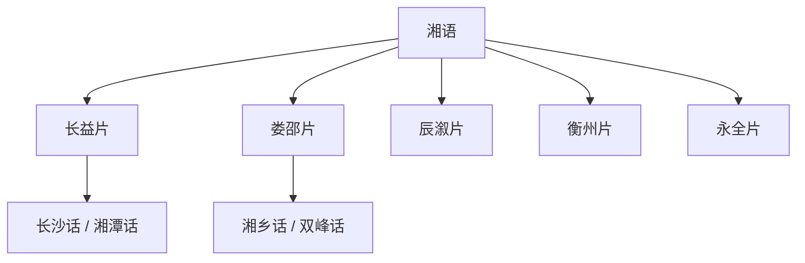

# 湘语

## 概括

主要分布于湖南及广西、贵州、四川局部。

## 分类关系

## 子系统

| 分支 / 语言 | 代表内容 |
|---|---|
| 长益片 | 长沙话、望城话、湘潭话、宁乡话、益阳话、沅江话、岳阳县话等。 |
| 娄邵片 | 湘乡话、双峰话、韶山话、娄底话、新化话、武冈话等。 |
| 辰溆片 | 溆浦话、泸溪话、辰溪话等。 |
| 衡州片 | 衡阳话、衡山话、衡东话等。 |
| 永全片 | 永州话、全州话、祁东话、祁阳话、江永话等。 |

## 说明

分片名称和代表点按现有材料整理；不同方言地图和学术方案可能存在边界差异。

## 上级

- [汉语族](/%E4%BA%BA%E6%96%87%E7%A7%91%E5%AD%A6/%E8%AF%AD%E8%A8%80/%E6%B1%89%E8%97%8F%E8%AF%AD%E7%B3%BB/%E6%B1%89%E8%AF%AD%E6%97%8F/README.md)

