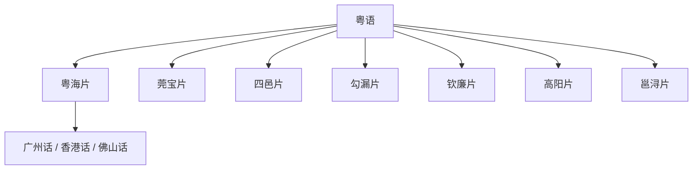

# 粤语

## 概括

主要分布于广东、广西、香港、澳门及海外粤语社群。

## 分类关系

## 子系统

| 分支 / 语言 | 代表内容 |
|---|---|
| 粤海片 | 广州话、香港话、佛山话等。 |
| 莞宝片 | 莞城话、深圳土著粤语等。 |
| 罗广片 | 肇庆话等。 |
| 勾漏片 | 玉林话等。 |
| 四邑片 | 台山话等。 |
| 吴化片 | 吴川话、化州话等。 |
| 钦廉片 | 北海话等。 |
| 高阳片 | 高州话等。 |
| 邕浔片 | 南宁白话等。 |
| 未分片 | 儋州话等。 |

## 说明

分片名称和代表点按现有材料整理；不同方言地图和学术方案可能存在边界差异。

## 上级

- [汉语族](/%E4%BA%BA%E6%96%87%E7%A7%91%E5%AD%A6/%E8%AF%AD%E8%A8%80/%E6%B1%89%E8%97%8F%E8%AF%AD%E7%B3%BB/%E6%B1%89%E8%AF%AD%E6%97%8F/README.md)

