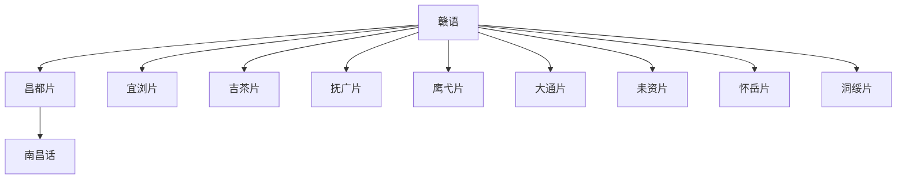

# 赣语

## 概括

主要分布于江西及湖南、湖北、安徽、福建局部。

## 分类关系

## 子系统

| 分支 / 语言 | 代表内容 |
|---|---|
| 昌都片 | 南昌话、都昌话、德安话、靖安话等。 |
| 宜浏片 | 宜春话、浏阳话、萍乡话、新余话、醴陵话等。 |
| 吉茶片 | 吉安话、永新话、井冈山话等。 |
| 抚广片 | 抚州话、南城话、广昌话等。 |
| 鹰弋片 | 鹰潭话、贵溪话、余干话、景德镇话等。 |
| 大通片 | 咸宁话、通山话、华容话、岳阳话等。 |
| 耒资片 | 耒阳话、永兴话、资兴话、常宁话、安仁话等。 |
| 怀岳片 | 怀宁话、太湖话、岳西话、宿松话、望江话等。 |
| 洞绥片 | 洞口话、绥宁话、隆回话等。 |

## 说明

分片名称和代表点按现有材料整理；不同方言地图和学术方案可能存在边界差异。

## 上级

- [汉语族](/%E4%BA%BA%E6%96%87%E7%A7%91%E5%AD%A6/%E8%AF%AD%E8%A8%80/%E6%B1%89%E8%97%8F%E8%AF%AD%E7%B3%BB/%E6%B1%89%E8%AF%AD%E6%97%8F/README.md)

