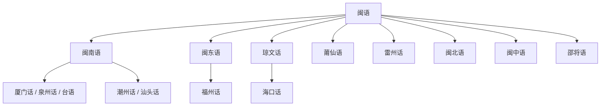

# 闽语

## 概括

主要分布于福建、台湾、海南、粤东、浙南及海外华人社群。

## 分类关系

## 子系统

| 分支 / 语言 | 代表内容 |
|---|---|
| 闽南语 | 厦门话、泉州话、台语、东南亚闽南语、潮州话、汕头话等。 |
| 闽东语 | 福州话、福清话、长乐话、福安话、蛮讲等。 |
| 琼文话 | 海口话、文昌话、万宁话、崖县话、昌江话等。 |
| 莆仙语 | 莆田话、仙游话、乌坵话等。 |
| 雷州话 | 雷城话等。 |
| 闽北语 | 建瓯话、建阳话、武夷山话等。 |
| 闽中语 | 三明话、沙县话、永安话等。 |
| 邵将语 | 邵武话、将乐话、光泽话、顺昌话等。 |

## 说明

分片名称和代表点按现有材料整理；不同方言地图和学术方案可能存在边界差异。

## 上级

- [汉语族](/%E4%BA%BA%E6%96%87%E7%A7%91%E5%AD%A6/%E8%AF%AD%E8%A8%80/%E6%B1%89%E8%97%8F%E8%AF%AD%E7%B3%BB/%E6%B1%89%E8%AF%AD%E6%97%8F/README.md)

