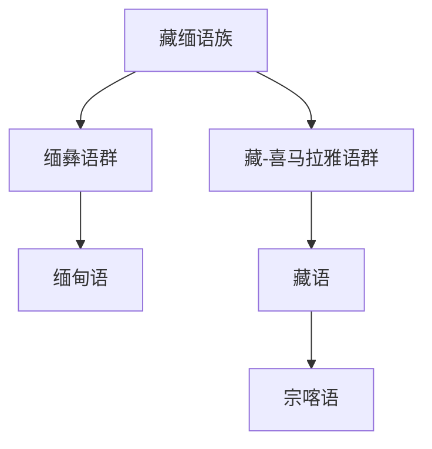

# 藏缅语族

## 概括

藏缅语族是汉藏语系中除汉语族之外的大量语言集合，分布于青藏高原、喜马拉雅、缅甸和中国西南等地。

## 分类关系

## 子系统

| 分支 / 语言 | 代表内容 | 说明 |
|---|---|---|
| 缅彝语群 | 缅甸语 | 本目录保留缅语支和缅甸语。 |
| 藏-喜马拉雅语群 | 藏语、宗喀语 | 藏语多用藏文；宗喀语是不丹重要语言。 |

## 说明

藏缅语族内部分类方案复杂，不同文献会采用不同名称和层级。

## 上级

- [汉藏语系](/%E4%BA%BA%E6%96%87%E7%A7%91%E5%AD%A6/%E8%AF%AD%E8%A8%80/%E6%B1%89%E8%97%8F%E8%AF%AD%E7%B3%BB/README.md)

