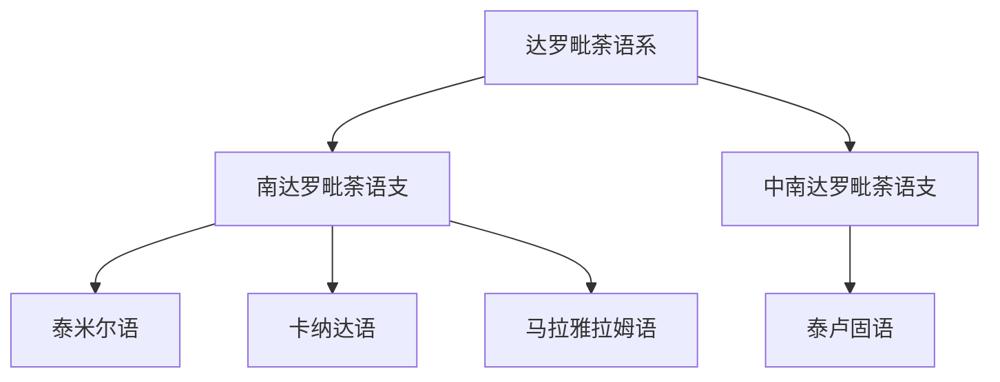

# 达罗毗荼语系

## 概括

达罗毗荼语系主要分布于南印度、斯里兰卡和南亚部分地区，代表语言包括泰米尔语、泰卢固语、卡纳达语、马拉雅拉姆语。

## 分类关系

## 子系统

| 分支 / 语言 | 代表内容 | 说明 |
|---|---|---|
| 南达罗毗荼语支 | 泰米尔语、卡纳达语、马拉雅拉姆语 | 南印度重要语言。 |
| 中南达罗毗荼语支 | 泰卢固语 | 印度安得拉、特伦甘纳等地区重要语言。 |

## 说明

达罗毗荼语系与印欧语系的印度-雅利安语言不同源，但长期接触产生许多区域共性。

## 上级

- [语言](/%E4%BA%BA%E6%96%87%E7%A7%91%E5%AD%A6/%E8%AF%AD%E8%A8%80/README.md)

