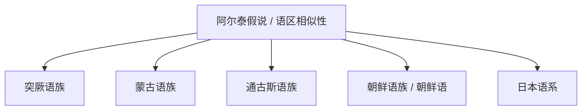

# 阿尔泰假说与相关语族

## 概括

传统资料常把突厥语族、蒙古语族、通古斯语族，甚至朝鲜语和日语放入“阿尔泰语系”。现代比较语言学中，这个大语系并未获得普遍接受；更稳妥的整理方式是把突厥语族、蒙古语族等作为各自已确认的语族，把“阿尔泰”作为历史假说或欧亚草原语区相似性说明。

## 分类关系

## 子系统

| 语族 / 语言 | 代表语言 | 说明 |
|---|---|---|
| [突厥语族](/%E4%BA%BA%E6%96%87%E7%A7%91%E5%AD%A6/%E8%AF%AD%E8%A8%80/%E9%98%BF%E5%B0%94%E6%B3%B0%E5%81%87%E8%AF%B4%E4%B8%8E%E7%9B%B8%E5%85%B3%E8%AF%AD%E6%97%8F/%E7%AA%81%E5%8E%A5%E8%AF%AD%E6%97%8F/README.md) | 土耳其语、维吾尔语、哈萨克语、乌兹别克语 | 已确认语族。 |
| [蒙古语族](/%E4%BA%BA%E6%96%87%E7%A7%91%E5%AD%A6/%E8%AF%AD%E8%A8%80/%E9%98%BF%E5%B0%94%E6%B3%B0%E5%81%87%E8%AF%B4%E4%B8%8E%E7%9B%B8%E5%85%B3%E8%AF%AD%E6%97%8F/%E8%92%99%E5%8F%A4%E8%AF%AD%E6%97%8F/README.md) | 蒙古语 | 已确认语族。 |

## 说明

- 不把“阿尔泰语系”写成已确定语系。
- 突厥语、蒙古语、通古斯语之间的相似性可以来自长期接触、借词、类型相似和区域扩散，不必然证明共同祖语。

