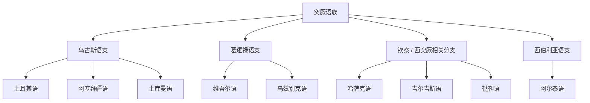

# 突厥语族

## 概括

突厥语族是欧亚大陆重要语族，分布从安纳托利亚、高加索、中亚到新疆和西伯利亚。

## 分类关系

## 子系统

| 分支 / 语言 | 代表内容 | 说明 |
|---|---|---|
| 乌古斯语支 | 土耳其语、阿塞拜疆语、土库曼语 | 土耳其语现代标准书写使用拉丁字母。 |
| 葛逻禄语支 | 维吾尔语、乌兹别克语 | 维吾尔语常用传统维文；乌兹别克语有多种书写传统。 |
| 钦察 / 西突厥相关分支 | 哈萨克语、吉尔吉斯语、鞑靼语 | “咸海-里海语支”等可归入更细分类。 |
| 西伯利亚语支 | 阿尔泰语 | 本目录保留阿尔泰语。 |

## 说明

这里按更常见的整理，把维吾尔语、乌兹别克语放在葛逻禄相关分支下；更细的东突厥、西突厥、钦察等分类可在后续扩展。

## 上级

- [阿尔泰假说与相关语族](/%E4%BA%BA%E6%96%87%E7%A7%91%E5%AD%A6/%E8%AF%AD%E8%A8%80/%E9%98%BF%E5%B0%94%E6%B3%B0%E5%81%87%E8%AF%B4%E4%B8%8E%E7%9B%B8%E5%85%B3%E8%AF%AD%E6%97%8F/README.md)

