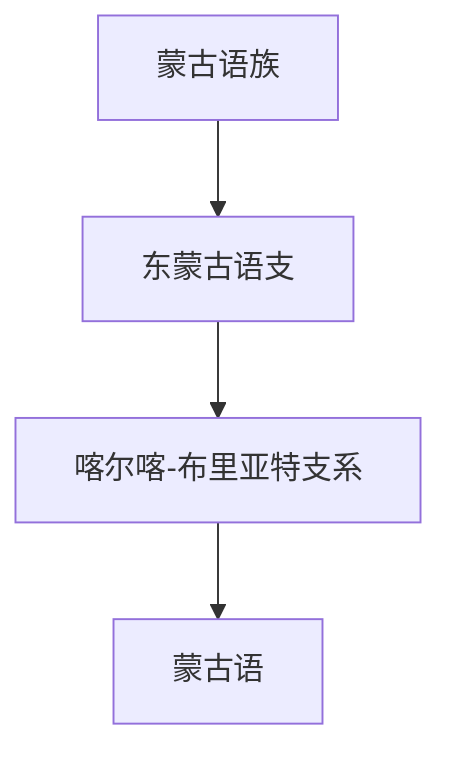

# 蒙古语族

## 概括

蒙古语族是欧亚草原和蒙古高原的重要语族，代表语言是蒙古语。

## 分类关系

## 子系统

| 分支 / 语言 | 代表内容 | 说明 |
|---|---|---|
| 东蒙古语支 | 蒙古语 | 可用传统蒙古文和西里尔字母等书写。 |

## 说明

蒙古语族与突厥语族并列为已确认语族；二者是否有更高层共同祖语属于阿尔泰假说范围。

## 上级

- [阿尔泰假说与相关语族](/%E4%BA%BA%E6%96%87%E7%A7%91%E5%AD%A6/%E8%AF%AD%E8%A8%80/%E9%98%BF%E5%B0%94%E6%B3%B0%E5%81%87%E8%AF%B4%E4%B8%8E%E7%9B%B8%E5%85%B3%E8%AF%AD%E6%97%8F/README.md)

