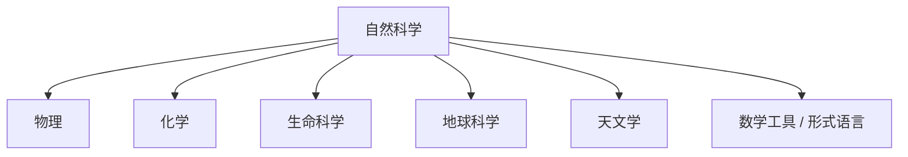

# 自然科学

自然科学研究自然界的结构、过程和规律。整理时优先分清研究对象的尺度、层级和解释框架，避免把不同学科的概念混在同一条线索中。

## 总览

## 核心分支

| 分支 | 研究对象 | 整理重点 |
| --- | --- | --- |
| [物理](/%E8%87%AA%E7%84%B6%E7%A7%91%E5%AD%A6/%E7%89%A9%E7%90%86/README.md) | 物质、能量、时空和相互作用 | 尺度层级、基本理论、适用范围 |
| 化学 | 物质组成、结构、反应和转化 | 原子分子层级、键合、反应机制 |
| 生命科学 | 生命系统的结构、功能、演化和生态关系 | 分子、细胞、个体、群体和生态层级 |
| 地球科学 | 地球系统及其物质循环、地质演化和环境过程 | 圈层结构、时间尺度、动力机制 |
| 天文学 | 天体、宇宙结构和宇宙演化 | 观测尺度、天体类型、宇宙学模型 |

## 整理原则

- 先区分尺度：微观、介观、宏观、天体和宇宙尺度常用不同模型。
- 再区分理论层级：基本定律、近似模型、经验规律和工程应用不能混写成同一类命题。
- 每个学科目录用 `README.md` 说明范围、主线和下级目录。具体概念、公式意义、例外和易混点放入子笔记。
