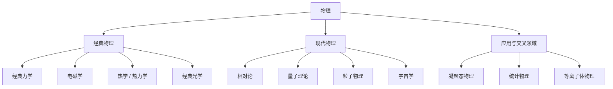

# 物理

物理研究物质、能量、时空结构和相互作用。它不是单一尺度上的知识清单，而是由不同适用范围的理论共同构成：经典理论适合日常和工程尺度，现代物理处理高速、强引力、微观量子和宇宙尺度问题。

## 体系关系

## 主要层级

| 层级 | 说明 | 子目录 |
| --- | --- | --- |
| 经典物理 | 以低速、弱引力、宏观尺度为主要适用范围，包含力学、电磁学、热学和经典光学等 | 待整理 |
| [现代物理](/%E8%87%AA%E7%84%B6%E7%A7%91%E5%AD%A6/%E7%89%A9%E7%90%86/%E7%8E%B0%E4%BB%A3%E7%89%A9%E7%90%86/README.md) | 处理经典理论失效或需要修正的领域，包括相对论、量子理论和宇宙学等 | 已建立 |
| 应用与交叉领域 | 把基本理论用于材料、统计系统、等离子体、天体和工程问题 | 待整理 |

## 关键易混点

- 理论有适用范围：牛顿力学不是“错误”，而是相对论在低速、弱引力条件下的近似。
- 现象和解释要分开：例如时间膨胀是可观测效应，狭义相对论和广义相对论分别给出不同场景下的解释。
- 尺度会改变主导因素：微观尺度常需要量子理论，天体和宇宙尺度常需要引力理论与相对论。
