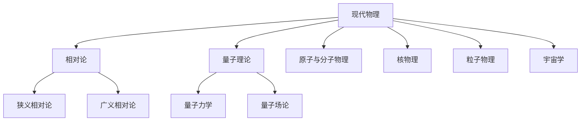

# 现代物理

现代物理主要处理经典物理难以解释的现象，尤其是高速运动、强引力、微观粒子和宇宙尺度问题。它不是完全替代经典物理，而是在更大的适用范围内修正或扩展经典理论。

## 体系关系

## 核心分支

| 分支 | 研究重点 | 说明 |
| --- | --- | --- |
| [相对论](/%E8%87%AA%E7%84%B6%E7%A7%91%E5%AD%A6/%E7%89%A9%E7%90%86/%E7%8E%B0%E4%BB%A3%E7%89%A9%E7%90%86/%E7%9B%B8%E5%AF%B9%E8%AE%BA/README.md) | 高速运动、时空结构、引力与几何 | 已整理狭义相对论和广义相对论 |
| 量子理论 | 微观系统、测量、能级、波粒二象性和场 | 待整理 |
| 原子与分子物理 | 原子结构、光谱、分子结构与相互作用 | 待整理 |
| 核物理 | 原子核结构、衰变、裂变、聚变 | 待整理 |
| 粒子物理 | 基本粒子和基本相互作用 | 待整理 |
| 宇宙学 | 宇宙整体结构、膨胀和演化 | 待整理 |

## 与经典物理的关系

- 低速、弱引力、宏观尺度下，现代物理通常会退化为经典近似。
- 高速接近光速时，狭义相对论修正时间、长度、动量和能量关系。
- 强引力或大尺度时，广义相对论把引力理解为时空几何效应。
- 微观尺度下，量子理论修正经典粒子轨道和连续能量的图像。
