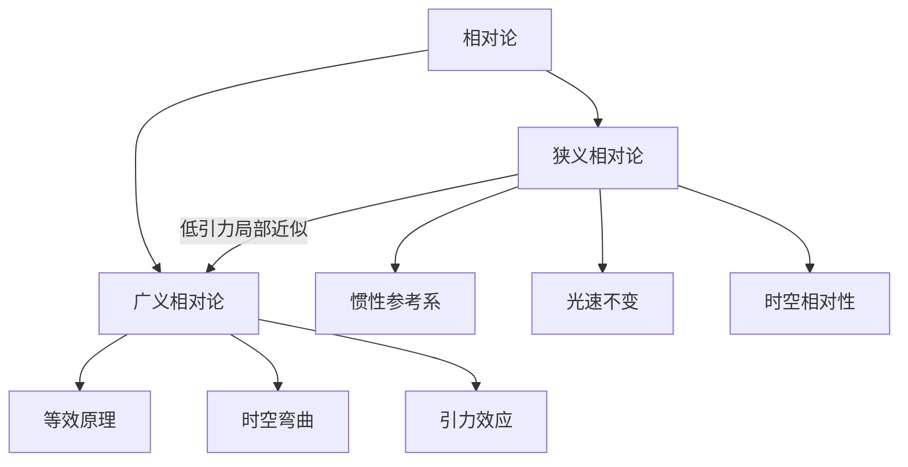

# 相对论

相对论是现代物理中关于时空、运动和引力的理论体系。狭义相对论处理惯性参考系中的高速运动和光速不变问题；广义相对论把引力解释为物质和能量造成的时空弯曲。

## 体系关系

## 核心笔记

| 笔记 | 适用范围 | 核心问题 |
| --- | --- | --- |
| [狭义相对论](/%E8%87%AA%E7%84%B6%E7%A7%91%E5%AD%A6/%E7%89%A9%E7%90%86/%E7%8E%B0%E4%BB%A3%E7%89%A9%E7%90%86/%E7%9B%B8%E5%AF%B9%E8%AE%BA/%E7%8B%AD%E4%B9%89%E7%9B%B8%E5%AF%B9%E8%AE%BA.md) | 惯性参考系、高速运动、弱引力或忽略引力 | 不同惯性参考系如何描述时间、长度和光速 |
| [广义相对论](/%E8%87%AA%E7%84%B6%E7%A7%91%E5%AD%A6/%E7%89%A9%E7%90%86/%E7%8E%B0%E4%BB%A3%E7%89%A9%E7%90%86/%E7%9B%B8%E5%AF%B9%E8%AE%BA/%E5%B9%BF%E4%B9%89%E7%9B%B8%E5%AF%B9%E8%AE%BA.md) | 非惯性参考系、引力场、天体和宇宙尺度 | 引力如何影响时空、光线和时间流逝 |

## 关键差异

| 对比项 | 狭义相对论 | 广义相对论 |
| --- | --- | --- |
| 主要对象 | 惯性参考系之间的运动关系 | 引力与加速度、物质能量和时空几何 |
| 引力处理 | 通常忽略引力 | 把引力解释为时空弯曲 |
| 典型效应 | 长度收缩、时间膨胀、同时性的相对性 | 光线弯曲、引力时间膨胀、引力红移 |
| 适用场景 | 高速粒子、卫星校时中的速度修正 | 强引力天体、宇宙学、GPS 引力修正 |
