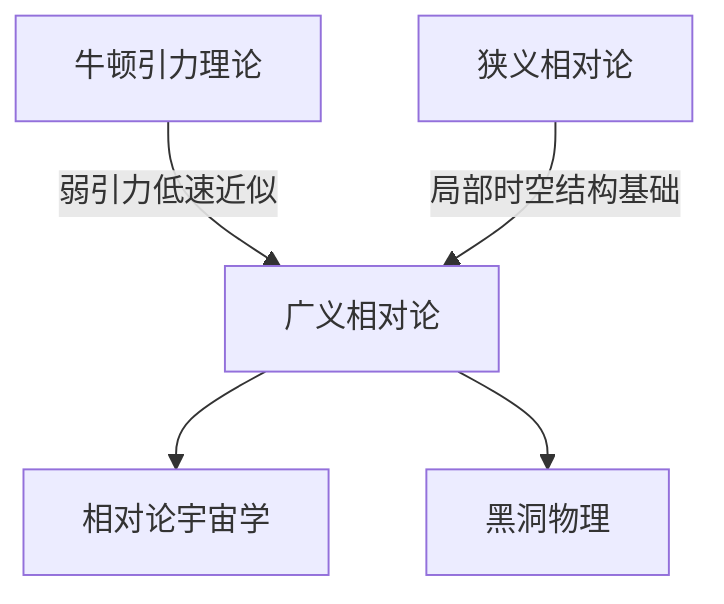

# 广义相对论

## 范围

广义相对论研究引力、加速度和时空几何之间的关系，适用于引力场、非惯性参考系、天体运动、黑洞和宇宙学等场景。

## 概括

广义相对论把引力理解为物质和能量改变时空几何后产生的效应。物体并不是被一种传统意义上的“力”拉动，而是在弯曲时空中沿自身的自然路径运动。

## 核心原理

| 原理 | 含义 | 说明 |
| --- | --- | --- |
| 等效原理 | 局部范围内，引力效应和加速度效应可以等效 | 例如在封闭空间中，均匀引力和等加速度运动会产生相似体验 |
| 时空弯曲 | 物质和能量影响时空几何，时空几何影响物体运动 | 这是广义相对论区别于牛顿引力理论的核心图像 |

## 主要效应

| 效应 | 概括 | 说明 |
| --- | --- | --- |
| 光线弯曲 | 光经过强引力场附近时传播路径会弯曲 | 因为光沿弯曲时空中的路径传播 |
| 引力时间膨胀 | 引力越强的地方，时钟走得越慢 | 靠近大质量天体时，时间流逝相对更慢 |
| 引力红移 | 光从强引力区域向弱引力区域传播时频率降低 | 频率降低表现为红移 |
| 引力蓝移 | 光从弱引力区域向强引力区域传播时频率升高 | 频率升高表现为蓝移 |

## 说明

- 广义相对论包含狭义相对论：在足够小的局部区域、且可忽略引力差异时，可以近似使用狭义相对论。
- 牛顿引力理论在弱引力、低速条件下仍是有效近似；广义相对论主要在强引力、高精度测量和宇宙尺度中显示差异。
- GPS 等卫星系统需要同时考虑速度导致的狭义相对论修正和引力导致的广义相对论修正。

## 演变关系

## 上级

- [相对论](/%E8%87%AA%E7%84%B6%E7%A7%91%E5%AD%A6/%E7%89%A9%E7%90%86/%E7%8E%B0%E4%BB%A3%E7%89%A9%E7%90%86/%E7%9B%B8%E5%AF%B9%E8%AE%BA/README.md)
- [现代物理](/%E8%87%AA%E7%84%B6%E7%A7%91%E5%AD%A6/%E7%89%A9%E7%90%86/%E7%8E%B0%E4%BB%A3%E7%89%A9%E7%90%86/README.md)

## 相关

- [狭义相对论](/%E8%87%AA%E7%84%B6%E7%A7%91%E5%AD%A6/%E7%89%A9%E7%90%86/%E7%8E%B0%E4%BB%A3%E7%89%A9%E7%90%86/%E7%9B%B8%E5%AF%B9%E8%AE%BA/%E7%8B%AD%E4%B9%89%E7%9B%B8%E5%AF%B9%E8%AE%BA.md)
