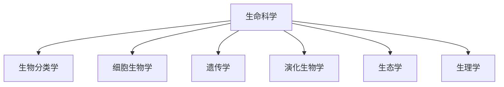

# 生命科学

生命科学研究生命系统的结构、功能、分类、演化和生态关系。整理时优先区分层级：分子、细胞、个体、种群、生态系统和演化谱系分别对应不同解释框架。

## 总览

## 核心分支

| 分支 | 研究对象 | 整理重点 |
| --- | --- | --- |
| [生物分类学](/%E8%87%AA%E7%84%B6%E7%A7%91%E5%AD%A6/%E7%94%9F%E5%91%BD%E7%A7%91%E5%AD%A6/%E7%94%9F%E7%89%A9%E5%88%86%E7%B1%BB%E5%AD%A6/README.md) | 生物类群的命名、分类和系统关系 | 阶元、演化关系、争议分类 |
| 细胞生物学 | 细胞结构、细胞器、细胞周期和细胞信号 | 细胞结构与功能对应关系 |
| 遗传学 | 遗传信息的传递、表达和变异 | DNA、基因、染色体、遗传规律 |
| 演化生物学 | 生物多样性的来源和变化 | 共同祖先、自然选择、分化和适应 |
| 生态学 | 生物与环境、生物之间的相互作用 | 个体、种群、群落、生态系统 |

## 整理原则

- 分类学笔记优先表达“上位类群 → 下位类群”的层级关系。
- 演化关系和分类阶元相关但不等同：分类层级是整理工具，系统发育关系更强调共同祖先和分支。
- 对有争议或仍在调整的类群，应在正文说明争议，不把暂定分类写成绝对结论。
