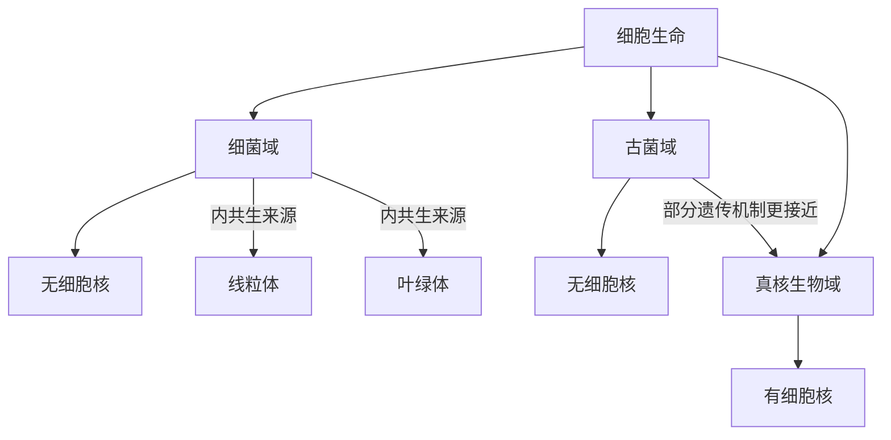

# 域

## 范围

域是生物分类中高于界的顶层阶元。这里采用细胞生命的三域框架：细菌域、古菌域和真核生物域。

## 分类关系

## 三域对比

| 域 | 细胞结构 | 典型特点 | 笔记 |
| --- | --- | --- | --- |
| 细菌域 | 原核细胞，无细胞核 | 数量极多，演化历史久；部分真核细胞器被认为源自细菌内共生 | [细菌域](/%E8%87%AA%E7%84%B6%E7%A7%91%E5%AD%A6/%E7%94%9F%E5%91%BD%E7%A7%91%E5%AD%A6/%E7%94%9F%E7%89%A9%E5%88%86%E7%B1%BB%E5%AD%A6/%E5%9F%9F/%E7%BB%86%E8%8F%8C%E5%9F%9F/README.md) |
| 古菌域 | 原核细胞，无细胞核 | 过去常被称为古细菌，但具有独立演化历史和特殊生化特征 | [古菌域](/%E8%87%AA%E7%84%B6%E7%A7%91%E5%AD%A6/%E7%94%9F%E5%91%BD%E7%A7%91%E5%AD%A6/%E7%94%9F%E7%89%A9%E5%88%86%E7%B1%BB%E5%AD%A6/%E5%9F%9F/%E5%8F%A4%E8%8F%8C%E5%9F%9F/README.md) |
| 真核生物域 | 真核细胞，有细胞核和多种膜性细胞器 | 包括动物、植物、真菌和其他真核类群 | [真核生物域](/%E8%87%AA%E7%84%B6%E7%A7%91%E5%AD%A6/%E7%94%9F%E5%91%BD%E7%A7%91%E5%AD%A6/%E7%94%9F%E7%89%A9%E5%88%86%E7%B1%BB%E5%AD%A6/%E5%9F%9F/%E7%9C%9F%E6%A0%B8%E7%94%9F%E7%89%A9%E5%9F%9F/README.md) |

## 图示

## 说明

- 三域系统把细胞生命分为细菌、古菌和真核生物三条主要谱系。
- “细菌界”“古菌界”等说法在不同体系中可能出现；在本目录中优先使用“域”来表示顶层分类。
- 病毒不属于细胞生命，是否纳入生命分类体系取决于具体分类框架；本目录暂不把病毒放入三域树。

## 上级

- [生物分类学](/%E8%87%AA%E7%84%B6%E7%A7%91%E5%AD%A6/%E7%94%9F%E5%91%BD%E7%A7%91%E5%AD%A6/%E7%94%9F%E7%89%A9%E5%88%86%E7%B1%BB%E5%AD%A6/README.md)
