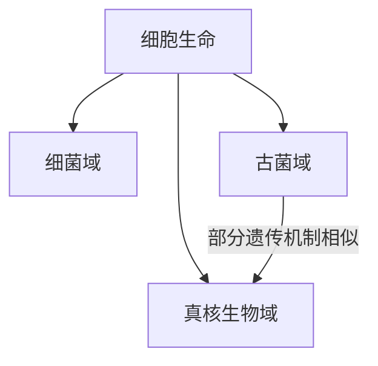

# 古菌域

## 范围

古菌域是一大类单细胞原核生物。古菌没有细胞核，也没有典型真核细胞那样的膜性细胞器，但在遗传机制和生化特征上与细菌有显著差异。

## 概括

古菌过去常被称为“古细菌”“古生菌”或“太古生物”。这种名称容易让人误以为古菌只是细菌的一支；现代分类中，古菌通常与细菌、真核生物并列为三域系统的一个域。

## 分类关系

## 说明

- 古菌与细菌相似之处包括没有细胞核和缺少典型膜性细胞器。
- 古菌也有一些接近真核生物的特征，例如部分遗传机制和染色质相关结构的相似性。
- 把古菌和细菌合称为“原核生物”可以描述细胞结构，但不能替代系统分类中的三域关系。
- 古菌具有独立演化历史和特殊生化差异，因此不宜简单写作“古老的细菌”。

## 上级

- [域](/%E8%87%AA%E7%84%B6%E7%A7%91%E5%AD%A6/%E7%94%9F%E5%91%BD%E7%A7%91%E5%AD%A6/%E7%94%9F%E7%89%A9%E5%88%86%E7%B1%BB%E5%AD%A6/%E5%9F%9F/README.md)
