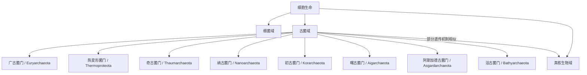

# 古菌域

## 范围

古菌域是一大类单细胞原核生物。古菌没有细胞核，也没有典型真核细胞那样的膜性细胞器，但在遗传机制和生化特征上与细菌有显著差异。

## 概括

古菌过去常被称为“古细菌”“古生菌”或“太古生物”。这种名称容易让人误以为古菌只是细菌的一支；现代分类中，古菌通常与细菌、真核生物并列为三域系统的一个域。

古菌域内部分类仍在快速调整，尤其是环境宏基因组发现了大量尚未培养的候选类群。本目录先建立常见的主要门级或候选门级入口，用于表达古菌域下的一级结构；具体纲、目、科、属、种暂不展开。

## 分类关系

## 主要门级入口

| 中文名 | 常用拉丁名 | 常见说明 | 链接 |
| --- | --- | --- | --- |
| 广古菌门 | Euryarchaeota | 传统古菌分类中的大类群，包含许多产甲烷古菌、极端嗜盐古菌和热酸环境类群 | [广古菌门](/%E8%87%AA%E7%84%B6%E7%A7%91%E5%AD%A6/%E7%94%9F%E5%91%BD%E7%A7%91%E5%AD%A6/%E7%94%9F%E7%89%A9%E5%88%86%E7%B1%BB%E5%AD%A6/%E5%9F%9F/%E5%8F%A4%E8%8F%8C%E5%9F%9F/%E5%B9%BF%E5%8F%A4%E8%8F%8C%E9%97%A8/README.md) |
| 热变形菌门 | Thermoproteota | 常见旧名 Crenarchaeota，中文常称泉古菌门；包括多种嗜热、嗜酸古菌 | [热变形菌门](/%E8%87%AA%E7%84%B6%E7%A7%91%E5%AD%A6/%E7%94%9F%E5%91%BD%E7%A7%91%E5%AD%A6/%E7%94%9F%E7%89%A9%E5%88%86%E7%B1%BB%E5%AD%A6/%E5%9F%9F/%E5%8F%A4%E8%8F%8C%E5%9F%9F/%E7%83%AD%E5%8F%98%E5%BD%A2%E8%8F%8C%E9%97%A8/README.md) |
| 奇古菌门 | Thaumarchaeota | 许多成员与氨氧化和氮循环相关，部分新命名体系中对应 Nitrososphaerota | [奇古菌门](/%E8%87%AA%E7%84%B6%E7%A7%91%E5%AD%A6/%E7%94%9F%E5%91%BD%E7%A7%91%E5%AD%A6/%E7%94%9F%E7%89%A9%E5%88%86%E7%B1%BB%E5%AD%A6/%E5%9F%9F/%E5%8F%A4%E8%8F%8C%E5%9F%9F/%E5%A5%87%E5%8F%A4%E8%8F%8C%E9%97%A8/README.md) |
| 纳古菌门 | Nanoarchaeota | 体型和基因组较小，多与共生或依附生活方式相关 | [纳古菌门](/%E8%87%AA%E7%84%B6%E7%A7%91%E5%AD%A6/%E7%94%9F%E5%91%BD%E7%A7%91%E5%AD%A6/%E7%94%9F%E7%89%A9%E5%88%86%E7%B1%BB%E5%AD%A6/%E5%9F%9F/%E5%8F%A4%E8%8F%8C%E5%9F%9F/%E7%BA%B3%E5%8F%A4%E8%8F%8C%E9%97%A8/README.md) |
| 初古菌门 | Korarchaeota | 多见于高温环境研究，常作为较早分支的候选古菌谱系讨论 | [初古菌门](/%E8%87%AA%E7%84%B6%E7%A7%91%E5%AD%A6/%E7%94%9F%E5%91%BD%E7%A7%91%E5%AD%A6/%E7%94%9F%E7%89%A9%E5%88%86%E7%B1%BB%E5%AD%A6/%E5%9F%9F/%E5%8F%A4%E8%8F%8C%E5%9F%9F/%E5%88%9D%E5%8F%A4%E8%8F%8C%E9%97%A8/README.md) |
| 曙古菌门 | Aigarchaeota | 主要来自环境基因组研究，常与 TACK 相关谱系一起讨论 | [曙古菌门](/%E8%87%AA%E7%84%B6%E7%A7%91%E5%AD%A6/%E7%94%9F%E5%91%BD%E7%A7%91%E5%AD%A6/%E7%94%9F%E7%89%A9%E5%88%86%E7%B1%BB%E5%AD%A6/%E5%9F%9F/%E5%8F%A4%E8%8F%8C%E5%9F%9F/%E6%9B%99%E5%8F%A4%E8%8F%8C%E9%97%A8/README.md) |
| 阿斯加德古菌门 | Asgardarchaeota | 与真核生物起源研究关系密切，包含 Lokiarchaeota 等常见亚群名称 | [阿斯加德古菌门](/%E8%87%AA%E7%84%B6%E7%A7%91%E5%AD%A6/%E7%94%9F%E5%91%BD%E7%A7%91%E5%AD%A6/%E7%94%9F%E7%89%A9%E5%88%86%E7%B1%BB%E5%AD%A6/%E5%9F%9F/%E5%8F%A4%E8%8F%8C%E5%9F%9F/%E9%98%BF%E6%96%AF%E5%8A%A0%E5%BE%B7%E5%8F%A4%E8%8F%8C%E9%97%A8/README.md) |
| 浴古菌门 | Bathyarchaeota | 主要来自沉积物和缺氧环境的宏基因组研究，生态功能多样 | [浴古菌门](/%E8%87%AA%E7%84%B6%E7%A7%91%E5%AD%A6/%E7%94%9F%E5%91%BD%E7%A7%91%E5%AD%A6/%E7%94%9F%E7%89%A9%E5%88%86%E7%B1%BB%E5%AD%A6/%E5%9F%9F/%E5%8F%A4%E8%8F%8C%E5%9F%9F/%E6%B5%B4%E5%8F%A4%E8%8F%8C%E9%97%A8/README.md) |

## 说明

- 古菌与细菌相似之处包括没有细胞核和缺少典型膜性细胞器。
- 古菌也有一些接近真核生物的特征，例如部分遗传机制和染色质相关结构的相似性。
- 把古菌和细菌合称为“原核生物”可以描述细胞结构，但不能替代系统分类中的三域关系。
- 古菌具有独立演化历史和特殊生化差异，因此不宜简单写作“古老的细菌”。
- 古菌门级分类存在传统名称、有效发表名称和候选门名称并行的情况；本目录以中文常用名组织入口，并在表格中保留常用拉丁名或新旧名提示。
- 本目录只建立古菌域下的一级子层；具体纲、目、科、属、种暂不展开。

## 上级

- [域](/%E8%87%AA%E7%84%B6%E7%A7%91%E5%AD%A6/%E7%94%9F%E5%91%BD%E7%A7%91%E5%AD%A6/%E7%94%9F%E7%89%A9%E5%88%86%E7%B1%BB%E5%AD%A6/%E5%9F%9F/README.md)
