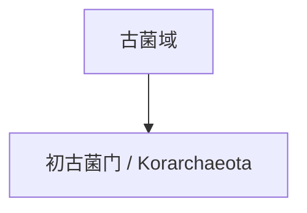

# 初古菌门

## 范围

初古菌门常用拉丁名为 Korarchaeota，是古菌域中常被作为早期分支或候选谱系讨论的类群。

## 概括

初古菌门多见于高温环境和环境基因组研究。由于可培养代表较少，它在分类体系中的位置常依赖分子系统发育和宏基因组证据。

## 分类关系

## 说明

- 初古菌门常用于讨论古菌早期演化分支。
- 其分类认识受环境样本和基因组数据影响较大。
- 本页只作为一级入口，不继续展开下级分类。

## 上级

- [古菌域](/%E8%87%AA%E7%84%B6%E7%A7%91%E5%AD%A6/%E7%94%9F%E5%91%BD%E7%A7%91%E5%AD%A6/%E7%94%9F%E7%89%A9%E5%88%86%E7%B1%BB%E5%AD%A6/%E5%9F%9F/%E5%8F%A4%E8%8F%8C%E5%9F%9F/README.md)
