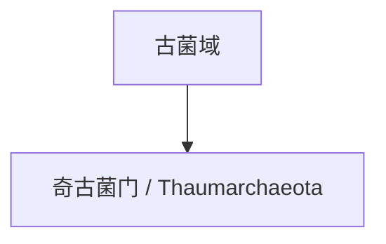

# 奇古菌门

## 范围

奇古菌门常用拉丁名为 Thaumarchaeota，部分较新的命名体系中可见 Nitrososphaerota 等对应名称。

## 概括

奇古菌门的许多成员与氨氧化作用和氮循环有关，广泛存在于海洋、土壤和其他环境中。它提醒人们古菌并不只生活在极端环境，也参与常见生态系统的物质循环。

## 分类关系

## 说明

- 奇古菌门常与氨氧化古菌相关联。
- 其生态意义主要体现在氮循环和环境微生物群落中。
- 本页只作为一级入口，不继续展开下级分类。

## 上级

- [古菌域](/%E8%87%AA%E7%84%B6%E7%A7%91%E5%AD%A6/%E7%94%9F%E5%91%BD%E7%A7%91%E5%AD%A6/%E7%94%9F%E7%89%A9%E5%88%86%E7%B1%BB%E5%AD%A6/%E5%9F%9F/%E5%8F%A4%E8%8F%8C%E5%9F%9F/README.md)
