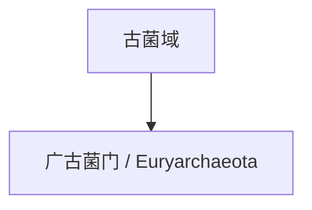

# 广古菌门

## 范围

广古菌门是传统古菌分类中使用很广的门级类群，常用拉丁名为 Euryarchaeota。

## 概括

广古菌门包含许多典型古菌类群，例如产甲烷古菌、极端嗜盐古菌以及部分嗜热或嗜酸类群。较新的命名和系统分类中，广古菌门内部可能被拆分或重排，因此这里先作为古菌域下的一级入口保留。

## 分类关系

## 说明

- 广古菌门是许多入门资料中最常见的古菌门级名称之一。
- 其内部成员生态类型差异很大，不能简单等同于某一种极端环境古菌。
- 本页只作为一级入口，不继续展开下级分类。

## 上级

- [古菌域](/%E8%87%AA%E7%84%B6%E7%A7%91%E5%AD%A6/%E7%94%9F%E5%91%BD%E7%A7%91%E5%AD%A6/%E7%94%9F%E7%89%A9%E5%88%86%E7%B1%BB%E5%AD%A6/%E5%9F%9F/%E5%8F%A4%E8%8F%8C%E5%9F%9F/README.md)
