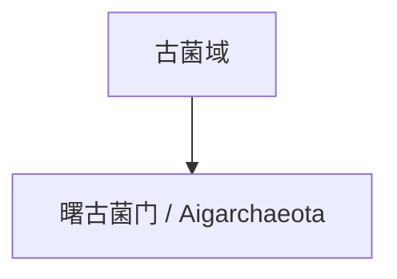

# 曙古菌门

## 范围

曙古菌门常用拉丁名为 Aigarchaeota，是主要由环境基因组资料支持的古菌候选门级类群。

## 概括

曙古菌门常与 TACK 相关古菌谱系一起讨论。它反映了现代古菌分类中大量类群来自环境测序而非传统培养观察的特点。

## 分类关系

## 说明

- 曙古菌门的边界和命名在不同分类体系中可能不同。
- 该类群适合作为了解古菌候选门和环境基因组分类的入口。
- 本页只作为一级入口，不继续展开下级分类。

## 上级

- [古菌域](/%E8%87%AA%E7%84%B6%E7%A7%91%E5%AD%A6/%E7%94%9F%E5%91%BD%E7%A7%91%E5%AD%A6/%E7%94%9F%E7%89%A9%E5%88%86%E7%B1%BB%E5%AD%A6/%E5%9F%9F/%E5%8F%A4%E8%8F%8C%E5%9F%9F/README.md)
