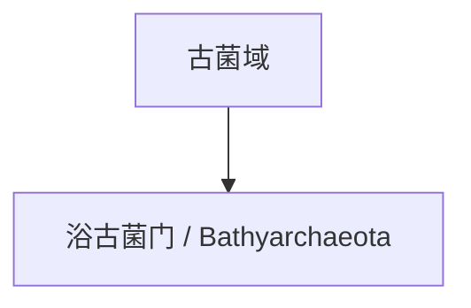

# 浴古菌门

## 范围

浴古菌门常用拉丁名为 Bathyarchaeota，是主要通过沉积物、缺氧环境和宏基因组研究认识的古菌候选门级类群。

## 概括

浴古菌门成员常见于海洋沉积物、淡水沉积物和其他缺氧环境，可能参与碳循环、氮循环或有机质降解等过程。它体现了现代古菌分类中环境测序的重要性。

## 分类关系

## 说明

- 浴古菌门的生态功能和内部边界仍在研究中。
- 该类群适合放在古菌环境多样性和沉积物微生物群落的语境下理解。
- 本页只作为一级入口，不继续展开下级分类。

## 上级

- [古菌域](/%E8%87%AA%E7%84%B6%E7%A7%91%E5%AD%A6/%E7%94%9F%E5%91%BD%E7%A7%91%E5%AD%A6/%E7%94%9F%E7%89%A9%E5%88%86%E7%B1%BB%E5%AD%A6/%E5%9F%9F/%E5%8F%A4%E8%8F%8C%E5%9F%9F/README.md)
