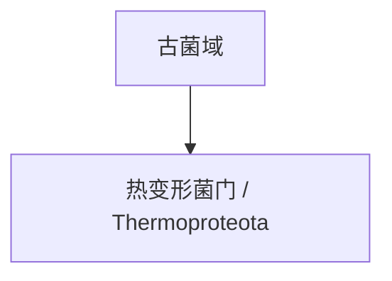

# 热变形菌门

## 范围

热变形菌门常用拉丁名为 Thermoproteota，常见旧名为 Crenarchaeota，中文资料中也常称为泉古菌门。

## 概括

热变形菌门包括多种与高温、酸性或火山热泉环境相关的古菌。它是古菌早期研究中非常重要的一支，也常出现在古菌与极端环境适应的讨论中。

## 分类关系

## 说明

- “热变形菌门”和“泉古菌门”在资料中可能对应不同命名体系下的相近类群。
- 许多代表成员具有耐高温或嗜酸特征，但该类群不能只按生活环境定义。
- 本页只作为一级入口，不继续展开下级分类。

## 上级

- [古菌域](/%E8%87%AA%E7%84%B6%E7%A7%91%E5%AD%A6/%E7%94%9F%E5%91%BD%E7%A7%91%E5%AD%A6/%E7%94%9F%E7%89%A9%E5%88%86%E7%B1%BB%E5%AD%A6/%E5%9F%9F/%E5%8F%A4%E8%8F%8C%E5%9F%9F/README.md)
