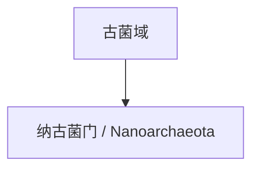

# 纳古菌门

## 范围

纳古菌门常用拉丁名为 Nanoarchaeota，部分命名体系中可见 Nanobdellota 等名称。

## 概括

纳古菌门通常指体型和基因组都较小的一类古菌，许多成员与其他古菌存在共生、依附或寄生式关系。它常被放在古菌小型基因组和共生演化的语境中理解。

## 分类关系

## 说明

- 纳古菌门名称中的“纳”强调其小型化特征。
- 该类群常用于说明古菌中也存在复杂的共生关系。
- 本页只作为一级入口，不继续展开下级分类。

## 上级

- [古菌域](/%E8%87%AA%E7%84%B6%E7%A7%91%E5%AD%A6/%E7%94%9F%E5%91%BD%E7%A7%91%E5%AD%A6/%E7%94%9F%E7%89%A9%E5%88%86%E7%B1%BB%E5%AD%A6/%E5%9F%9F/%E5%8F%A4%E8%8F%8C%E5%9F%9F/README.md)
