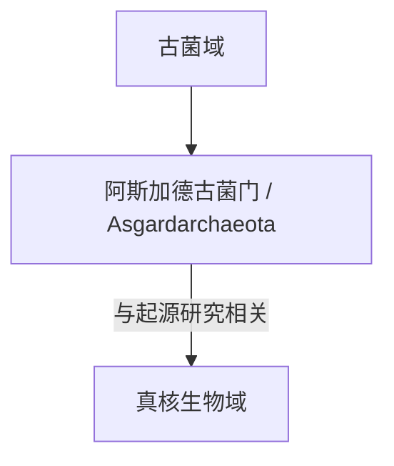

# 阿斯加德古菌门

## 范围

阿斯加德古菌门常用拉丁名为 Asgardarchaeota，是与真核生物起源研究关系密切的古菌类群。

## 概括

阿斯加德古菌因含有一些与真核细胞特征相关的基因而受到重视。它常被用来讨论真核生物如何从古菌相关祖先与细菌内共生事件中演化出来。

## 分类关系

## 说明

- 阿斯加德古菌常见相关名称包括 Lokiarchaeota 等，但本页不继续展开这些下级或并行名称。
- 其重要性主要在于真核生物起源和细胞复杂性演化研究。
- 本页只作为一级入口，不继续展开下级分类。

## 上级

- [古菌域](/%E8%87%AA%E7%84%B6%E7%A7%91%E5%AD%A6/%E7%94%9F%E5%91%BD%E7%A7%91%E5%AD%A6/%E7%94%9F%E7%89%A9%E5%88%86%E7%B1%BB%E5%AD%A6/%E5%9F%9F/%E5%8F%A4%E8%8F%8C%E5%9F%9F/README.md)
