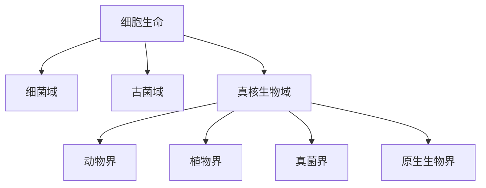

# 真核生物域

## 范围

真核生物域包括细胞具有细胞核的单细胞和多细胞生物。动物、植物、真菌和多种原生生物都属于真核生物域；细菌和古菌不属于真核生物域。

## 概括

真核生物与原核型细胞生命的根本差异在于细胞内具有由膜包裹的细胞核。许多真核细胞还具有线粒体、叶绿体、高尔基体等细胞器，细胞分裂过程也与没有细胞核的细菌、古菌不同。

## 分类关系

## 核心界

| 界 | 概括 | 说明 | 链接 |
| --- | --- | --- | --- |
| 动物界 | 多细胞、异养、通常能主动运动的真核生物 | 已继续展开到主要动物门、脊椎动物和哺乳动物等层级 | [动物界](/%E8%87%AA%E7%84%B6%E7%A7%91%E5%AD%A6/%E7%94%9F%E5%91%BD%E7%A7%91%E5%AD%A6/%E7%94%9F%E7%89%A9%E5%88%86%E7%B1%BB%E5%AD%A6/%E5%9F%9F/%E7%9C%9F%E6%A0%B8%E7%94%9F%E7%89%A9%E5%9F%9F/%E5%8A%A8%E7%89%A9%E7%95%8C/README.md) |
| 植物界 | 以光合作用为重要特征的真核生物类群 | 本次只建立界级入口，不继续展开 | [植物界](/%E8%87%AA%E7%84%B6%E7%A7%91%E5%AD%A6/%E7%94%9F%E5%91%BD%E7%A7%91%E5%AD%A6/%E7%94%9F%E7%89%A9%E5%88%86%E7%B1%BB%E5%AD%A6/%E5%9F%9F/%E7%9C%9F%E6%A0%B8%E7%94%9F%E7%89%A9%E5%9F%9F/%E6%A4%8D%E7%89%A9%E7%95%8C/README.md) |
| 真菌界 | 以吸收营养为主，具有真菌性细胞结构和生活史的真核生物 | 本次只建立界级入口，不继续展开 | [真菌界](/%E8%87%AA%E7%84%B6%E7%A7%91%E5%AD%A6/%E7%94%9F%E5%91%BD%E7%A7%91%E5%AD%A6/%E7%94%9F%E7%89%A9%E5%88%86%E7%B1%BB%E5%AD%A6/%E5%9F%9F/%E7%9C%9F%E6%A0%B8%E7%94%9F%E7%89%A9%E5%9F%9F/%E7%9C%9F%E8%8F%8C%E7%95%8C/README.md) |
| 原生生物界 | 不属于动物、植物、真菌的多种真核生物传统集合 | 便利性整理入口，不是严格单系自然类群 | [原生生物界](/%E8%87%AA%E7%84%B6%E7%A7%91%E5%AD%A6/%E7%94%9F%E5%91%BD%E7%A7%91%E5%AD%A6/%E7%94%9F%E7%89%A9%E5%88%86%E7%B1%BB%E5%AD%A6/%E5%9F%9F/%E7%9C%9F%E6%A0%B8%E7%94%9F%E7%89%A9%E5%9F%9F/%E5%8E%9F%E7%94%9F%E7%94%9F%E7%89%A9%E7%95%8C/README.md) |

## 说明

- 真核生物在演化上通常被视为单源类群。
- 真核生物与古菌在部分基因和生化性质上有相似性；真核细胞也与细菌内共生事件密切相关。
- “动物界、植物界、真菌界、原生生物界”是适合学习导航的传统真核四界口径；现代系统发育分类会把许多原生生物分散到多个真核大类群中。
- 原笔记中的“细菌与古菌的基因融合体”可理解为真核起源研究中的复合来源观点：宿主谱系与内共生细菌共同塑造了真核细胞。

## 上级

- [域](/%E8%87%AA%E7%84%B6%E7%A7%91%E5%AD%A6/%E7%94%9F%E5%91%BD%E7%A7%91%E5%AD%A6/%E7%94%9F%E7%89%A9%E5%88%86%E7%B1%BB%E5%AD%A6/%E5%9F%9F/README.md)
