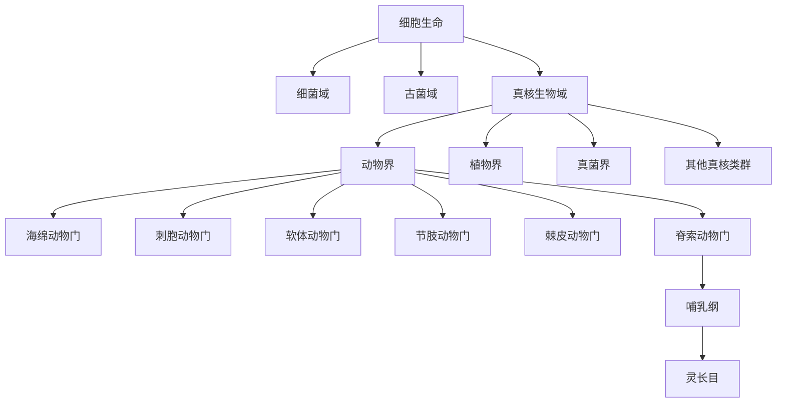

# 真核生物域

## 范围

真核生物域包括细胞具有细胞核的单细胞和多细胞生物。动物、植物、真菌和许多其他真核类群都属于真核生物域；细菌和古菌不属于真核生物域。

## 概括

真核生物与原核型细胞生命的根本差异在于细胞内具有由膜包裹的细胞核。许多真核细胞还具有线粒体、叶绿体、高尔基体等细胞器，细胞分裂过程也与没有细胞核的细菌、古菌不同。

## 分类关系

## 核心类群

| 类群 | 概括 | 链接 |
| --- | --- | --- |
| 动物界 | 多细胞、异养、通常能主动运动的真核生物 | [动物界](/%E8%87%AA%E7%84%B6%E7%A7%91%E5%AD%A6/%E7%94%9F%E5%91%BD%E7%A7%91%E5%AD%A6/%E7%94%9F%E7%89%A9%E5%88%86%E7%B1%BB%E5%AD%A6/%E5%9F%9F/%E7%9C%9F%E6%A0%B8%E7%94%9F%E7%89%A9%E5%9F%9F/%E5%8A%A8%E7%89%A9%E7%95%8C/README.md) |
| 植物界 | 以光合作用为重要特征的多细胞真核生物 | 待整理 |
| 真菌界 | 以吸收营养为主的真核生物类群 | 待整理 |
| 其他真核类群 | 包括多种单细胞或简单多细胞真核生物 | 待整理 |

## 说明

- 真核生物在演化上通常被视为单源类群。
- 真核生物与古菌在部分基因和生化性质上有相似性；真核细胞也与细菌内共生事件密切相关。
- 原笔记中的“细菌与古菌的基因融合体”可理解为真核起源研究中的复合来源观点：宿主谱系与内共生细菌共同塑造了真核细胞。

## 上级

- [域](/%E8%87%AA%E7%84%B6%E7%A7%91%E5%AD%A6/%E7%94%9F%E5%91%BD%E7%A7%91%E5%AD%A6/%E7%94%9F%E7%89%A9%E5%88%86%E7%B1%BB%E5%AD%A6/%E5%9F%9F/README.md)
