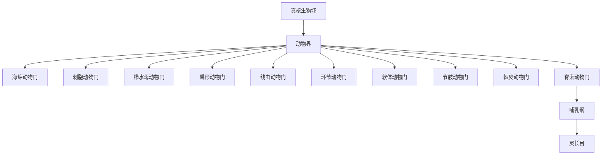

# 动物界

## 范围

动物界是真核生物域中的一个主要类群，包含多细胞、异养、通常具有胚胎发育过程和主动运动能力的生物。

## 概括

本目录以“门”为动物界下的顶级导航层。动物门的数量和边界在不同分类体系中会有差异；这里优先列出学习和检索中最常见、最适合作为目录入口的主要动物门，并保留继续补充较小门类的空间。

## 分类关系

## 主要动物门

| 门 | 常见代表 | 关键特征 | 链接 |
| --- | --- | --- | --- |
| 海绵动物门 | 海绵 | 体制简单，多数营固着滤食生活，缺少真正组织和器官 | [海绵动物门](/%E8%87%AA%E7%84%B6%E7%A7%91%E5%AD%A6/%E7%94%9F%E5%91%BD%E7%A7%91%E5%AD%A6/%E7%94%9F%E7%89%A9%E5%88%86%E7%B1%BB%E5%AD%A6/%E5%9F%9F/%E7%9C%9F%E6%A0%B8%E7%94%9F%E7%89%A9%E5%9F%9F/%E5%8A%A8%E7%89%A9%E7%95%8C/%E6%B5%B7%E7%BB%B5%E5%8A%A8%E7%89%A9%E9%97%A8/README.md) |
| 刺胞动物门 | 水母、珊瑚、海葵 | 具有刺细胞，辐射对称，常见水螅型和水母型 | [刺胞动物门](/%E8%87%AA%E7%84%B6%E7%A7%91%E5%AD%A6/%E7%94%9F%E5%91%BD%E7%A7%91%E5%AD%A6/%E7%94%9F%E7%89%A9%E5%88%86%E7%B1%BB%E5%AD%A6/%E5%9F%9F/%E7%9C%9F%E6%A0%B8%E7%94%9F%E7%89%A9%E5%9F%9F/%E5%8A%A8%E7%89%A9%E7%95%8C/%E5%88%BA%E8%83%9E%E5%8A%A8%E7%89%A9%E9%97%A8/README.md) |
| 栉水母动物门 | 栉水母 | 具有栉板，用于游动；常见胶质透明体 | [栉水母动物门](/%E8%87%AA%E7%84%B6%E7%A7%91%E5%AD%A6/%E7%94%9F%E5%91%BD%E7%A7%91%E5%AD%A6/%E7%94%9F%E7%89%A9%E5%88%86%E7%B1%BB%E5%AD%A6/%E5%9F%9F/%E7%9C%9F%E6%A0%B8%E7%94%9F%E7%89%A9%E5%9F%9F/%E5%8A%A8%E7%89%A9%E7%95%8C/%E6%A0%89%E6%B0%B4%E6%AF%8D%E5%8A%A8%E7%89%A9%E9%97%A8/README.md) |
| 扁形动物门 | 涡虫、吸虫、绦虫 | 身体背腹扁平，多为两侧对称，无体腔 | [扁形动物门](/%E8%87%AA%E7%84%B6%E7%A7%91%E5%AD%A6/%E7%94%9F%E5%91%BD%E7%A7%91%E5%AD%A6/%E7%94%9F%E7%89%A9%E5%88%86%E7%B1%BB%E5%AD%A6/%E5%9F%9F/%E7%9C%9F%E6%A0%B8%E7%94%9F%E7%89%A9%E5%9F%9F/%E5%8A%A8%E7%89%A9%E7%95%8C/%E6%89%81%E5%BD%A2%E5%8A%A8%E7%89%A9%E9%97%A8/README.md) |
| 线虫动物门 | 蛔虫、秀丽隐杆线虫 | 身体细长，有角质层，假体腔，许多为自由生活或寄生 | [线虫动物门](/%E8%87%AA%E7%84%B6%E7%A7%91%E5%AD%A6/%E7%94%9F%E5%91%BD%E7%A7%91%E5%AD%A6/%E7%94%9F%E7%89%A9%E5%88%86%E7%B1%BB%E5%AD%A6/%E5%9F%9F/%E7%9C%9F%E6%A0%B8%E7%94%9F%E7%89%A9%E5%9F%9F/%E5%8A%A8%E7%89%A9%E7%95%8C/%E7%BA%BF%E8%99%AB%E5%8A%A8%E7%89%A9%E9%97%A8/README.md) |
| 环节动物门 | 蚯蚓、水蛭、多毛类 | 身体分节，具有较明显的体腔和器官系统 | [环节动物门](/%E8%87%AA%E7%84%B6%E7%A7%91%E5%AD%A6/%E7%94%9F%E5%91%BD%E7%A7%91%E5%AD%A6/%E7%94%9F%E7%89%A9%E5%88%86%E7%B1%BB%E5%AD%A6/%E5%9F%9F/%E7%9C%9F%E6%A0%B8%E7%94%9F%E7%89%A9%E5%9F%9F/%E5%8A%A8%E7%89%A9%E7%95%8C/%E7%8E%AF%E8%8A%82%E5%8A%A8%E7%89%A9%E9%97%A8/README.md) |
| 软体动物门 | 蜗牛、贝类、章鱼、乌贼 | 多数有外套膜、足和内脏团，部分具有贝壳 | [软体动物门](/%E8%87%AA%E7%84%B6%E7%A7%91%E5%AD%A6/%E7%94%9F%E5%91%BD%E7%A7%91%E5%AD%A6/%E7%94%9F%E7%89%A9%E5%88%86%E7%B1%BB%E5%AD%A6/%E5%9F%9F/%E7%9C%9F%E6%A0%B8%E7%94%9F%E7%89%A9%E5%9F%9F/%E5%8A%A8%E7%89%A9%E7%95%8C/%E8%BD%AF%E4%BD%93%E5%8A%A8%E7%89%A9%E9%97%A8/README.md) |
| 节肢动物门 | 昆虫、蜘蛛、甲壳类、蜈蚣 | 身体分节，具外骨骼和分节附肢，是物种数最多的动物门 | [节肢动物门](/%E8%87%AA%E7%84%B6%E7%A7%91%E5%AD%A6/%E7%94%9F%E5%91%BD%E7%A7%91%E5%AD%A6/%E7%94%9F%E7%89%A9%E5%88%86%E7%B1%BB%E5%AD%A6/%E5%9F%9F/%E7%9C%9F%E6%A0%B8%E7%94%9F%E7%89%A9%E5%9F%9F/%E5%8A%A8%E7%89%A9%E7%95%8C/%E8%8A%82%E8%82%A2%E5%8A%A8%E7%89%A9%E9%97%A8/README.md) |
| 棘皮动物门 | 海星、海胆、海参 | 成体多为五辐射对称，具水管系统，多为海生 | [棘皮动物门](/%E8%87%AA%E7%84%B6%E7%A7%91%E5%AD%A6/%E7%94%9F%E5%91%BD%E7%A7%91%E5%AD%A6/%E7%94%9F%E7%89%A9%E5%88%86%E7%B1%BB%E5%AD%A6/%E5%9F%9F/%E7%9C%9F%E6%A0%B8%E7%94%9F%E7%89%A9%E5%9F%9F/%E5%8A%A8%E7%89%A9%E7%95%8C/%E6%A3%98%E7%9A%AE%E5%8A%A8%E7%89%A9%E9%97%A8/README.md) |
| 脊索动物门 | 鱼类、两栖类、爬行类、鸟类、哺乳类 | 至少在某一发育阶段具有脊索等特征 | [脊索动物门](/%E8%87%AA%E7%84%B6%E7%A7%91%E5%AD%A6/%E7%94%9F%E5%91%BD%E7%A7%91%E5%AD%A6/%E7%94%9F%E7%89%A9%E5%88%86%E7%B1%BB%E5%AD%A6/%E5%9F%9F/%E7%9C%9F%E6%A0%B8%E7%94%9F%E7%89%A9%E5%9F%9F/%E5%8A%A8%E7%89%A9%E7%95%8C/%E8%84%8A%E7%B4%A2%E5%8A%A8%E7%89%A9%E9%97%A8/README.md) |

## 其他常见门类

| 门 | 常见代表 | 说明 | 链接 |
| --- | --- | --- | --- |
| 轮形动物门 | 轮虫 | 小型水生动物，头部常有轮盘状纤毛结构 | [轮形动物门](/%E8%87%AA%E7%84%B6%E7%A7%91%E5%AD%A6/%E7%94%9F%E5%91%BD%E7%A7%91%E5%AD%A6/%E7%94%9F%E7%89%A9%E5%88%86%E7%B1%BB%E5%AD%A6/%E5%9F%9F/%E7%9C%9F%E6%A0%B8%E7%94%9F%E7%89%A9%E5%9F%9F/%E5%8A%A8%E7%89%A9%E7%95%8C/%E8%BD%AE%E5%BD%A2%E5%8A%A8%E7%89%A9%E9%97%A8/README.md) |
| 苔藓动物门 | 苔藓虫 | 多为水生群体动物，不是植物中的苔藓 | [苔藓动物门](/%E8%87%AA%E7%84%B6%E7%A7%91%E5%AD%A6/%E7%94%9F%E5%91%BD%E7%A7%91%E5%AD%A6/%E7%94%9F%E7%89%A9%E5%88%86%E7%B1%BB%E5%AD%A6/%E5%9F%9F/%E7%9C%9F%E6%A0%B8%E7%94%9F%E7%89%A9%E5%9F%9F/%E5%8A%A8%E7%89%A9%E7%95%8C/%E8%8B%94%E8%97%93%E5%8A%A8%E7%89%A9%E9%97%A8/README.md) |
| 腕足动物门 | 腕足类 | 具两片壳，外形类似双壳类但亲缘关系不同 | [腕足动物门](/%E8%87%AA%E7%84%B6%E7%A7%91%E5%AD%A6/%E7%94%9F%E5%91%BD%E7%A7%91%E5%AD%A6/%E7%94%9F%E7%89%A9%E5%88%86%E7%B1%BB%E5%AD%A6/%E5%9F%9F/%E7%9C%9F%E6%A0%B8%E7%94%9F%E7%89%A9%E5%9F%9F/%E5%8A%A8%E7%89%A9%E7%95%8C/%E8%85%95%E8%B6%B3%E5%8A%A8%E7%89%A9%E9%97%A8/README.md) |
| 缓步动物门 | 水熊虫 | 体型微小，具短足，以耐受极端环境能力著称 | [缓步动物门](/%E8%87%AA%E7%84%B6%E7%A7%91%E5%AD%A6/%E7%94%9F%E5%91%BD%E7%A7%91%E5%AD%A6/%E7%94%9F%E7%89%A9%E5%88%86%E7%B1%BB%E5%AD%A6/%E5%9F%9F/%E7%9C%9F%E6%A0%B8%E7%94%9F%E7%89%A9%E5%9F%9F/%E5%8A%A8%E7%89%A9%E7%95%8C/%E7%BC%93%E6%AD%A5%E5%8A%A8%E7%89%A9%E9%97%A8/README.md) |

## 说明

- “门”是动物界下的重要分类阶元，但不同教材和数据库对小型门类、合并关系和中文译名可能不完全一致。
- 本目录先建立常见门类入口；每个门下后续可按“纲 → 目 → 科 → 属 → 种”继续展开。
- 脊索动物门已有下级整理到哺乳纲和灵长目。

## 上级

- [真核生物域](/%E8%87%AA%E7%84%B6%E7%A7%91%E5%AD%A6/%E7%94%9F%E5%91%BD%E7%A7%91%E5%AD%A6/%E7%94%9F%E7%89%A9%E5%88%86%E7%B1%BB%E5%AD%A6/%E5%9F%9F/%E7%9C%9F%E6%A0%B8%E7%94%9F%E7%89%A9%E5%9F%9F/README.md)
