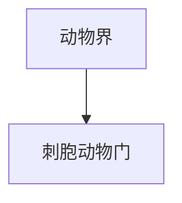

# 刺胞动物门

## 范围

刺胞动物门属于动物界，常见代表包括水母、珊瑚、海葵和水螅等。

## 概括

刺胞动物以刺细胞为重要特征，多数为辐射对称，常见生活型包括水螅型和水母型。

## 分类关系

## 说明

- 刺细胞可用于捕食和防御。
- 珊瑚类在海洋生态系统中能形成重要的珊瑚礁结构。
- 刺胞动物与栉水母动物都常被直观称作“水母类”，但二者属于不同动物门。

## 上级

- [动物界](/%E8%87%AA%E7%84%B6%E7%A7%91%E5%AD%A6/%E7%94%9F%E5%91%BD%E7%A7%91%E5%AD%A6/%E7%94%9F%E7%89%A9%E5%88%86%E7%B1%BB%E5%AD%A6/%E5%9F%9F/%E7%9C%9F%E6%A0%B8%E7%94%9F%E7%89%A9%E5%9F%9F/%E5%8A%A8%E7%89%A9%E7%95%8C/README.md)
