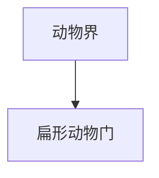

# 扁形动物门

## 范围

扁形动物门属于动物界，常见代表包括涡虫、吸虫和绦虫等。

## 概括

扁形动物身体背腹扁平，多为两侧对称，一般无真正体腔。该门中既有自由生活类群，也有寄生类群。

## 分类关系

## 说明

- 涡虫常作为自由生活扁形动物代表。
- 吸虫、绦虫等许多类群营寄生生活。
- 扁形动物比辐射对称动物具有更明显的前后轴和两侧对称体制。

## 上级

- [动物界](/%E8%87%AA%E7%84%B6%E7%A7%91%E5%AD%A6/%E7%94%9F%E5%91%BD%E7%A7%91%E5%AD%A6/%E7%94%9F%E7%89%A9%E5%88%86%E7%B1%BB%E5%AD%A6/%E5%9F%9F/%E7%9C%9F%E6%A0%B8%E7%94%9F%E7%89%A9%E5%9F%9F/%E5%8A%A8%E7%89%A9%E7%95%8C/README.md)
