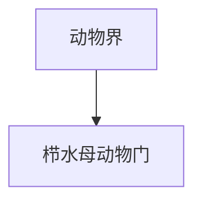

# 栉水母动物门

## 范围

栉水母动物门属于动物界，常见代表为栉水母。

## 概括

栉水母动物多为海生，体表具有成列的栉板，用纤毛结构游动。它们常呈透明胶质体，与刺胞动物门的水母外形相似但分类不同。

## 分类关系

## 说明

- 运动结构以栉板为典型特征。
- 多数为捕食性海洋动物。
- 与刺胞动物不同，栉水母没有刺胞动物那种典型刺细胞。

## 上级

- [动物界](/%E8%87%AA%E7%84%B6%E7%A7%91%E5%AD%A6/%E7%94%9F%E5%91%BD%E7%A7%91%E5%AD%A6/%E7%94%9F%E7%89%A9%E5%88%86%E7%B1%BB%E5%AD%A6/%E5%9F%9F/%E7%9C%9F%E6%A0%B8%E7%94%9F%E7%89%A9%E5%9F%9F/%E5%8A%A8%E7%89%A9%E7%95%8C/README.md)
