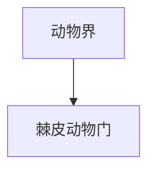

# 棘皮动物门

## 范围

棘皮动物门属于动物界，常见代表包括海星、海胆、海参、海百合和蛇尾等。

## 概括

棘皮动物多为海生，成体常呈五辐射对称，具有独特的水管系统。它们与脊索动物同属后口动物大类，亲缘关系上比外形直觉更接近脊索动物。

## 分类关系

## 说明

- 海星和海胆是常见代表。
- 成体多为辐射对称，但幼体通常具有两侧对称特征。
- 水管系统参与运动、取食和气体交换等功能。

## 上级

- [动物界](/%E8%87%AA%E7%84%B6%E7%A7%91%E5%AD%A6/%E7%94%9F%E5%91%BD%E7%A7%91%E5%AD%A6/%E7%94%9F%E7%89%A9%E5%88%86%E7%B1%BB%E5%AD%A6/%E5%9F%9F/%E7%9C%9F%E6%A0%B8%E7%94%9F%E7%89%A9%E5%9F%9F/%E5%8A%A8%E7%89%A9%E7%95%8C/README.md)
